# SimpleProvider RAG Implementation

## Overview

The SimpleProvider offers a lightweight, high-performance RAG implementation using JSON storage with advanced text search algorithms. It provides excellent search quality without the complexity of vector embeddings, making it perfect for small to medium-sized knowledge bases.

## Current Architecture

```mermaid
graph TD
    A["📱 Slack User"] --> B["🤖 Slack Handler"]
    B --> C["🌉 LLM-MCP Bridge"]
    C --> D["🔍 RAG Client (MCP Tool)"]
    D --> E["🏭 Provider Factory"]
    E --> F["📄 SimpleProvider<br/>(JSON + Advanced Text Search)"]
    F --> G["📊 Local JSON Storage"]
    G --> F
    F --> D
    D --> C
    C --> H["🧠 LLM Response"]
    H --> B
    B --> A
    
    I["📁 PDF Files"] --> J["⚡ CLI Ingest"]
    J --> K["📚 LangChain Document Processing"]
    K --> F
```



## Key Features

1. **✅ Advanced Text Search** - Multi-factor relevance scoring with term frequency, phrase matching, and coverage analysis
2. **✅ Optimal Performance** - O(n log n) sorting and efficient document processing
3. **✅ VectorProvider Interface** - Clean abstraction compatible with the provider registry
4. **✅ LangChain Integration** - Uses LangChain Go for PDF processing and text splitting
5. **✅ Production Ready** - Comprehensive error handling and resource management
6. **✅ Zero Dependencies** - No external vector databases required
7. **✅ High Performance** - Suitable for knowledge bases up to 10,000+ documents

## Current Implementation

### 1. VectorProvider Interface

Located in `internal/rag/provider_interface.go`:

```go
// VectorProvider defines the interface for all vector store providers
type VectorProvider interface {
    // Document Management
    IngestFile(ctx context.Context, filePath string, metadata map[string]string) (string, error)
    IngestFiles(ctx context.Context, filePaths []string, metadata map[string]string) ([]string, error)
    DeleteFile(ctx context.Context, fileID string) error
    ListFiles(ctx context.Context, limit int) ([]FileInfo, error)
    
    // Search Operations
    Search(ctx context.Context, query string, options SearchOptions) ([]SearchResult, error)
    
    // Statistics and Management
    GetStats(ctx context.Context) (*VectorStoreStats, error)
    Initialize(ctx context.Context) error
    Close() error
}

// SearchOptions configures search behavior
type SearchOptions struct {
    Limit    int     // Maximum number of results to return
    MinScore float32 // Minimum relevance score threshold
}

// SearchResult represents a single search result
type SearchResult struct {
    Content    string            // Document content
    Score      float32           // Relevance score (0.0 to 10.0+)
    FileID     string            // Source file identifier  
    FileName   string            // Source file name
    Metadata   map[string]string // Additional metadata
    Highlights []string          // Highlighted search terms
}
```

### 2. SimpleProvider Implementation

Located in `internal/rag/simple_provider.go` (435 lines):

```go
// SimpleProvider implements VectorProvider using JSON file storage
type SimpleProvider struct {
    dbPath    string
    documents []SimpleDocument
}

// SimpleDocument represents a document chunk in the knowledge base
type SimpleDocument struct {
    ID       string            `json:"id"`
    Content  string            `json:"content"`
    Metadata map[string]string `json:"metadata"`
}

// Advanced relevance scoring with multiple factors
func (s *SimpleProvider) calculateRelevanceScore(content, query string, queryTerms []string) float64 {
    if content == "" || query == "" {
        return 0
    }

    var score float64

    // 1. Exact phrase match (highest weight)
    if strings.Contains(content, query) {
        score += 10.0
    }

    // 2. Individual term matches with term frequency
    contentWords := strings.Fields(content)
    contentWordSet := make(map[string]int)
    for _, word := range contentWords {
        contentWordSet[word]++
    }

    matchingTerms := 0
    for _, term := range queryTerms {
        if count, exists := contentWordSet[term]; exists {
            matchingTerms++
            // Term frequency component
            tf := float64(count) / float64(len(contentWords))
            score += tf * 5.0
        }
    }

    // 3. Coverage bonus (how many query terms are matched)
    if len(queryTerms) > 0 {
        coverage := float64(matchingTerms) / float64(len(queryTerms))
        score += coverage * 3.0
    }

    // 4. Partial word matches (lower weight)
    for _, term := range queryTerms {
        if len(term) > 3 {
            for _, word := range contentWords {
                if strings.Contains(word, term) && word != term {
                    score += 0.5
                }
            }
        }
    }

    return score
}

// High-performance search with O(n log n) sorting
func (s *SimpleProvider) Search(ctx context.Context, query string, options SearchOptions) ([]SearchResult, error) {
    if len(s.documents) == 0 {
        return []SearchResult{}, nil
    }

    limit := options.Limit
    if limit <= 0 {
        limit = 10
    }

    // Calculate scores for all documents
    var scores []DocumentScore
    queryLower := strings.ToLower(query)
    queryTerms := strings.Fields(queryLower)

    for _, doc := range s.documents {
        contentLower := strings.ToLower(doc.Content)
        score := s.calculateRelevanceScore(contentLower, queryLower, queryTerms)
        
        if score > 0 {
            scores = append(scores, DocumentScore{
                Document: doc,
                Score:    score,
            })
        }
    }

    // Sort by score (descending) - O(n log n)
    sort.Slice(scores, func(i, j int) bool {
        return scores[i].Score > scores[j].Score
    })

    // Limit results
    if len(scores) > limit {
        scores = scores[:limit]
    }

    // Convert to SearchResult format
    results := make([]SearchResult, len(scores))
    for i, scored := range scores {
        fileName := scored.Document.Metadata["file_name"]
        fileID := scored.Document.Metadata["file_path"]

        result := SearchResult{
            Content:    scored.Document.Content,
            Score:      float32(scored.Score),
            FileID:     fileID,
            FileName:   fileName,
            Metadata:   scored.Document.Metadata,
            Highlights: s.extractHighlights(scored.Document.Content, queryTerms),
        }

        results[i] = result
    }

    return results, nil
}
```

### 3. Provider Registration

SimpleProvider automatically registers itself in the provider factory:

```go
// Automatic registration in simple_provider.go init()
func init() {
    RegisterVectorProvider("simple", func(config map[string]interface{}) (VectorProvider, error) {
        dbPath := "./knowledge.json"
        if path, ok := config["database_path"].(string); ok && path != "" {
            dbPath = path
        }
        return NewSimpleProvider(dbPath), nil
    })
}

// Usage through factory
provider, err := CreateVectorProvider("simple", map[string]interface{}{
    "database_path": "./my-knowledge.json",
})
```

### 4. MCP Client Integration

Located in `internal/rag/client.go` (238 lines):

```go
// Client wraps vector providers to implement the MCP tool interface
type Client struct {
    provider VectorProvider
    maxDocs  int // Maximum documents to return in a single call
}

// NewClient creates a new RAG client with simple provider (legacy compatibility)
func NewClient(ragDatabase string) *Client {
    config := map[string]interface{}{
        "provider":      "simple",
        "database_path": ragDatabase,
    }

    provider, err := CreateProviderFromConfig(config)
    if err != nil {
        // Fallback to simple provider for backward compatibility
        simpleProvider := NewSimpleProvider(ragDatabase)
        _ = simpleProvider.Initialize(context.Background())
        return &Client{
            provider: simpleProvider,
            maxDocs:  10,
        }
    }

    return &Client{
        provider: provider,
        maxDocs:  10,
    }
}

// CallTool implements the MCP tool interface for RAG operations
func (c *Client) CallTool(ctx context.Context, toolName string, args map[string]interface{}) (string, error) {
    switch toolName {
    case "rag_search":
        return c.handleRAGSearch(ctx, args)
    case "rag_ingest":
        return c.handleRAGIngest(ctx, args)
    case "rag_stats":
        return c.handleRAGStats(ctx, args)
    default:
        return "", fmt.Errorf("unknown RAG tool: %s. Available tools: rag_search, rag_ingest, rag_stats", toolName)
    }
}

// handleRAGSearch processes search requests with enhanced formatting
func (c *Client) handleRAGSearch(ctx context.Context, args map[string]interface{}) (string, error) {
    // Extract and validate query parameter
    query, err := c.extractStringParam(args, "query", true)
    if err != nil {
        return "", err
    }

    // Extract optional limit parameter with validation
    limit := c.maxDocs
    if limitParam, exists := args["limit"]; exists {
        if limitInt, ok := limitParam.(int); ok {
            limit = limitInt
        } else if limitFloat, ok := limitParam.(float64); ok {
            limit = int(limitFloat)
        } else if limitStr, ok := limitParam.(string); ok {
            if parsed, parseErr := strconv.Atoi(limitStr); parseErr == nil {
                limit = parsed
            }
        }
    }

    // Clamp limit to reasonable bounds
    if limit <= 0 {
        limit = 3
    }
    if limit > 20 {
        limit = 20
    }

    // Perform search using the provider
    results, err := c.provider.Search(ctx, query, SearchOptions{
        Limit: limit,
    })
    if err != nil {
        return "", fmt.Errorf("search failed: %w", err)
    }

    // Format results for display
    if len(results) == 0 {
        return "No relevant context found for query: '" + query + "'", nil
    }

    // Build response string with scores and highlights
    var response strings.Builder
    response.WriteString(fmt.Sprintf("Found %d relevant context(s) for '%s':\n", len(results), query))

    for i, result := range results {
        response.WriteString(fmt.Sprintf("--- Context %d ---\n", i+1))

        // Add source information if available
        if result.FileName != "" {
            response.WriteString(fmt.Sprintf("Source: %s", result.FileName))
            if result.Score > 0 {
                response.WriteString(fmt.Sprintf(" (score: %.2f)", result.Score))
            }
            response.WriteString("\n")
        }

        // Add content
        response.WriteString(fmt.Sprintf("Content: %s\n", result.Content))

        // Add highlights if available
        if len(result.Highlights) > 0 {
            response.WriteString(fmt.Sprintf("Highlights: %s\n", strings.Join(result.Highlights, " | ")))
        }
    }

    return response.String(), nil
}
```

## Usage Examples

### CLI Usage
```bash
# Ingest PDFs with SimpleProvider (default)
slack-mcp-client --rag-ingest ./company-docs --rag-db ./knowledge.json

# Search with SimpleProvider
slack-mcp-client --rag-search "vacation policy" --rag-db ./knowledge.json

# Force SimpleProvider (when multiple providers available)
slack-mcp-client --rag-ingest ./docs --rag-provider simple --rag-db ./knowledge.json
slack-mcp-client --rag-search "query" --rag-provider simple --rag-db ./knowledge.json
```

### Via Slack MCP Tool
```json
{
  "tool": "rag_search",
  "args": {
    "query": "What is the company vacation policy?",
    "limit": 5
  }
}
```

### Provider Factory Usage
```go
// Create SimpleProvider via factory
provider, err := CreateVectorProvider("simple", map[string]interface{}{
    "database_path": "./knowledge.json",
})

// Search documents
results, err := provider.Search(context.Background(), "vacation policy", SearchOptions{
    Limit: 10,
})

// Ingest new file
fileID, err := provider.IngestFile(context.Background(), "./policy.pdf", map[string]string{
    "category": "hr",
    "version": "2024",
})
```

### Configuration
```json
{
  "llm_providers": {
    "openai": {
      "api_key": "${OPENAI_API_KEY}",
      "model": "gpt-4o",
      "rag_enabled": true,
      "rag_provider": "simple",
      "rag_database": "./knowledge.json"
    }
  }
}
```

## Performance Characteristics

### SimpleProvider Strengths

| Feature | Performance | Notes |
|---------|-------------|-------|
| **Search Algorithm** | O(n log n) | Built-in Go sort for optimal performance |
| **Memory Usage** | Low | JSON documents loaded into memory once |
| **Startup Time** | Fast | No vector index building required |
| **Storage** | Minimal | Simple JSON file format |
| **Dependencies** | Zero | No external databases or services |

### Search Quality Features

**Multi-Factor Relevance Scoring:**
```go
func calculateRelevanceScore(content, query string, queryTerms []string) float64 {
    var score float64

    // 1. Exact phrase match (weight: 10.0)
    if strings.Contains(content, query) {
        score += 10.0
    }

    // 2. Term frequency analysis (weight: 5.0 per term)
    for _, term := range queryTerms {
        if count, exists := contentWordSet[term]; exists {
            tf := float64(count) / float64(len(contentWords))
            score += tf * 5.0
        }
    }

    // 3. Query coverage bonus (weight: 3.0)
    coverage := float64(matchingTerms) / float64(len(queryTerms))
    score += coverage * 3.0

    // 4. Partial matching (weight: 0.5)
    // ... additional scoring factors
}
```

**Benefits:**
- **Phrase matching**: Exact phrases get highest scores
- **Term frequency**: Common terms weighted appropriately
- **Coverage analysis**: Rewards documents matching more query terms
- **Partial matching**: Finds related terms and substrings

## Benefits of SimpleProvider

### ✅ **Current Advantages**

1. **Zero Setup** - No external databases or services required
2. **High Performance** - O(n log n) search with advanced scoring algorithms  
3. **Production Ready** - Comprehensive error handling and resource management
4. **VectorProvider Compatible** - Works with the unified provider interface
5. **LangChain Integration** - Uses LangChain Go for document processing
6. **Memory Efficient** - Documents loaded once, efficient search operations
7. **Portable** - Single JSON file, easy backup and migration
8. **Fast Startup** - No index building or initialization delays

### ✅ **When to Use SimpleProvider**

**Ideal for:**
- **Small to medium knowledge bases** (up to 10,000+ documents)
- **Development and testing** environments
- **Single-instance deployments** without clustering needs
- **Quick prototyping** and proof-of-concept projects
- **Cost-sensitive scenarios** where external services aren't viable

**Consider alternatives when:**
- Knowledge base exceeds 50,000+ documents
- Semantic similarity is more important than keyword matching
- Multi-language support is required
- Distributed/clustered deployment is needed

### ✅ **Migration Path**

**Current State:**
- SimpleProvider fully implemented and production-ready
- Clean VectorProvider interface enables easy provider switching
- Provider registry supports multiple implementations

**Future Options:**
- **OpenAI Vector Store**: Already implemented for semantic search
- **Local Vector Databases**: ChromaDB, FAISS, Qdrant (when needed)
- **Cloud Vector Stores**: Pinecone, Weaviate (for scale)
- **Hybrid Solutions**: Multiple providers with intelligent routing

**Migration Process:**
```bash
# Current: SimpleProvider
slack-mcp-client --rag-provider simple --rag-ingest ./docs

# Future: Switch to any other provider
slack-mcp-client --rag-provider openai --rag-ingest ./docs
slack-mcp-client --rag-provider chroma --rag-ingest ./docs
```
