# Ultra-Simplified RAG Implementation

## Overview

A minimal approach to adding RAG capabilities to the existing Slack MCP Client by treating RAG as an MCP tool, leveraging existing patterns, and avoiding over-engineering.

## Ultra-Simplified Architecture

```mermaid
graph TD
    A["📱 Slack User"] --> B["🤖 Existing Slack Handler"]
    B --> C["🌉 Existing LLM-MCP Bridge"]
    C --> D{"Tool Needed?"}
    D -->|RAG Query| E["🔍 RAG Tool<br/>(JSON Storage)"]
    D -->|Other| F["🛠️ Other MCP Tools"]
    D -->|No Tool| G["🧠 Direct LLM"]
    E --> H["📄 Context Documents"]
    H --> G
    F --> G
    G --> I["💬 Response"]
    I --> B
    B --> A
    
    J["📁 PDF Files"] --> K["⚡ Manual Ingest"]
    K --> E
```



## Key Simplifications

1. **RAG as MCP Tool** - Use existing tool registration patterns, no LLM interface changes
2. **JSON Storage** - Simple file-based storage, no SQLite dependency  
3. **Manual Ingestion** - CLI-based PDF processing, no file watching complexity
4. **Existing Bridge Integration** - Works with current LLM-MCP bridge architecture
5. **Zero New Dependencies** - Only uses existing LangChain + standard library

## Implementation

### 1. Simple RAG Tool (Single File Implementation)

```go
// internal/rag/simple.go - Everything in one file (~200 lines total)
package rag

import (
    "context"
    "encoding/json"
    "fmt"
    "os"
    "path/filepath"
    "strings"
    
    "github.com/mark3labs/mcp-go/mcp"
    "github.com/tmc/langchaingo/documentloaders"
    "github.com/tmc/langchaingo/textsplitter"
    "github.com/tuannvm/slack-mcp-client/internal/llm"
)

type SimpleRAG struct {
    dbPath    string
    documents []Document
}

type Document struct {
    Content  string            `json:"content"`
    Metadata map[string]string `json:"metadata"`
}

func NewSimpleRAG(dbPath string) *SimpleRAG {
    rag := &SimpleRAG{dbPath: dbPath}
    rag.load()
    return rag
}

// Simple text search - good enough to start
func (r *SimpleRAG) Search(query string, limit int) []Document {
    queryLower := strings.ToLower(query)
    var results []Document
    
    for _, doc := range r.documents {
        if strings.Contains(strings.ToLower(doc.Content), queryLower) {
            results = append(results, doc)
            if len(results) >= limit {
                break
            }
        }
    }
    return results
}

// Process PDF using existing LangChain patterns
func (r *SimpleRAG) IngestPDF(filePath string) error {
    file, err := os.Open(filePath)
    if err != nil {
        return err
    }
    defer file.Close()
    
    info, _ := file.Stat()
    loader := documentloaders.NewPDF(file, info.Size())
    
    splitter := textsplitter.NewRecursiveCharacter(
        textsplitter.WithChunkSize(1000),
        textsplitter.WithChunkOverlap(200),
    )
    
    docs, err := loader.LoadAndSplit(context.Background(), splitter)
    if err != nil {
        return err
    }
    
    // Convert to our format and append
    for i, doc := range docs {
        r.documents = append(r.documents, Document{
            Content: doc.PageContent,
            Metadata: map[string]string{
                "file_path":   filePath,
                "chunk_index": fmt.Sprintf("%d", i),
            },
        })
    }
    
    return r.save()
}

// Save/load JSON storage
func (r *SimpleRAG) save() error {
    data, err := json.MarshalIndent(r.documents, "", "  ")
    if err != nil {
        return err
    }
    return os.WriteFile(r.dbPath, data, 0644)
}

func (r *SimpleRAG) load() {
    data, err := os.ReadFile(r.dbPath)
    if err != nil {
        r.documents = []Document{} // Start empty if file doesn't exist
        return
    }
    json.Unmarshal(data, &r.documents)
}

// Convert to MCP Tool Handler (integrates with existing bridge)
func (r *SimpleRAG) AsMCPHandler() *llm.MCPHandler {
    return &llm.MCPHandler{
        Name:        "rag_search",
        Description: "Search knowledge base for relevant context",
        HandleFunc: func(ctx context.Context, req mcp.CallToolRequest) (*mcp.CallToolResult, error) {
            query, ok := req.Params.Arguments["query"].(string)
            if !ok {
                return nil, fmt.Errorf("query parameter required")
            }
            
            docs := r.Search(query, 3)
            
            // Build context for LLM
            var contextBuilder strings.Builder
            contextBuilder.WriteString("Found relevant context:\n\n")
            for i, doc := range docs {
                contextBuilder.WriteString(fmt.Sprintf("Context %d:\n%s\n\n", i+1, doc.Content))
            }
            
            if len(docs) == 0 {
                contextBuilder.WriteString("No relevant context found in knowledge base.")
            }
            
            return llm.CreateMCPResult(contextBuilder.String()), nil
        },
    }
}
```

### 2. Configuration Integration (Existing Pattern)

```go
// No new config structure needed - extend existing LLM provider config
// In mcp-servers.json or similar config:

{
  "llm_provider": "langchain",
  "llm_providers": {
    "langchain": {
      "type": "openai", 
      "model": "gpt-4o",
      "rag_enabled": true,
      "rag_database": "./knowledge.json"
    }
  },
  "servers": {
    // ... existing MCP servers
  }
}
```

### 3. Tool Registration (Existing Bridge Integration)

```go
// In cmd/main.go - integrate with existing tool registration system
func startSlackClient(logger *logging.Logger, mcpClients map[string]*mcp.Client, discoveredTools map[string]common.ToolInfo, cfg *config.Config) {
    // Check if RAG is enabled in LLM provider config
    ragEnabled := false
    ragDatabase := "./knowledge.json"
    
    if providerConfig, ok := cfg.LLMProviders[cfg.LLMProvider]; ok {
        if enabled, exists := providerConfig["rag_enabled"]; exists {
            ragEnabled = enabled.(bool)
        }
        if dbPath, exists := providerConfig["rag_database"]; exists {
            ragDatabase = dbPath.(string)
        }
    }
    
    // Initialize RAG tool if enabled
    if ragEnabled {
        logger.Info("Initializing RAG tool with database: %s", ragDatabase)
        
        simpleRAG := rag.NewSimpleRAG(ragDatabase)
        ragHandler := simpleRAG.AsMCPHandler()
        
        // Add RAG tool to discovered tools (integrates with existing bridge)
        discoveredTools["rag_search"] = common.ToolInfo{
            Name:        "rag_search",
            Description: "Search knowledge base for relevant context",
            InputSchema: map[string]interface{}{
                "type": "object",
                "properties": map[string]interface{}{
                    "query": map[string]interface{}{
                        "type":        "string",
                        "description": "Search query for knowledge base",
                    },
                },
                "required": []string{"query"},
            },
        }
        
        logger.Info("RAG tool registered and available for LLM to use")
    }
    
    // Continue with existing initialization...
    // The LLM-MCP bridge will automatically handle RAG tool calls
}
```

### 4. CLI Commands for Manual Ingestion

```go
// Add to cmd/main.go flags  
var (
    ragIngest = flag.String("rag-ingest", "", "Ingest PDF files from directory and exit")
    ragSearch = flag.String("rag-search", "", "Search RAG database and exit")
    ragDatabase = flag.String("rag-db", "./knowledge.json", "Path to RAG database file")
)

func main() {
    flag.Parse()
    
    // Handle RAG utility commands first (these exit after completion)
    if *ragIngest != "" {
        handleRAGIngest(*ragIngest)
        return
    }
    
    if *ragSearch != "" {
        handleRAGSearch(*ragSearch)
        return
    }
    
    // Normal startup continues...
}

func handleRAGIngest(path string) {
    fmt.Printf("Ingesting PDF files from: %s\n", path)
    simpleRAG := rag.NewSimpleRAG(*ragDatabase)
    
    count := 0
    err := filepath.Walk(path, func(filePath string, info os.FileInfo, err error) error {
        if filepath.Ext(filePath) == ".pdf" {
            fmt.Printf("Processing: %s\n", filePath)
            if err := simpleRAG.IngestPDF(filePath); err != nil {
                fmt.Printf("  Error: %v\n", err)
            } else {
                count++
                fmt.Printf("  ✓ Processed\n")
            }
        }
        return nil
    })
    
    if err != nil {
        log.Fatalf("Error walking directory: %v", err)
    }
    
    fmt.Printf("Ingestion complete. Processed %d PDF files.\n", count)
}

func handleRAGSearch(query string) {
    simpleRAG := rag.NewSimpleRAG(*ragDatabase)
    docs := simpleRAG.Search(query, 5)
    
    fmt.Printf("Search results for: %s\n", query)
    fmt.Printf("Found %d documents:\n\n", len(docs))
    
    for i, doc := range docs {
        fmt.Printf("--- Result %d ---\n", i+1)
        fmt.Printf("Content: %.200s...\n", doc.Content)
        if filePath, ok := doc.Metadata["file_path"]; ok {
            fmt.Printf("Source: %s\n", filepath.Base(filePath))
        }
        fmt.Println()
    }
}
```

## Usage Examples

### Ingesting Documents
```bash
# Ingest PDF files into knowledge base (one-time setup)
./slack-mcp-client --rag-ingest ./company-docs

# Test search functionality
./slack-mcp-client --rag-search "vacation policy"
```

### Starting Slack Bot with RAG
```bash
# Configure RAG in your mcp-servers.json:
{
  "llm_provider": "langchain",
  "llm_providers": {
    "langchain": {
      "type": "openai", 
      "model": "gpt-4o",
      "rag_enabled": true,
      "rag_database": "./knowledge.json"
    }
  }
}

# Start the bot - RAG tool will be automatically available
./slack-mcp-client
```

### How RAG Works in Slack
When RAG is enabled, the LLM can automatically use the `rag_search` tool:

**User in Slack**: "What's our vacation policy?"

**LLM Response**: "I'll search our knowledge base for information about vacation policy."
*(LLM automatically calls rag_search tool)*

**Tool Response**: "Found relevant context: [vacation policy content]"

**Final LLM Response**: "Based on our company policy, you get 15 days of vacation..."

## Benefits of Ultra-Simplified Approach

1. ✅ **Zero Interface Changes** - Uses existing LLM-MCP bridge patterns
2. ✅ **Zero New Dependencies** - Only JSON storage + existing LangChain
3. ✅ **Automatic LLM Integration** - RAG becomes discoverable tool 
4. ✅ **Existing Tool Ecosystem** - Works with all current MCP tools
5. ✅ **Human-Readable Storage** - JSON files can be inspected/edited
6. ✅ **Minimal Code** - 200 lines vs 2000+ in complex approach
7. ✅ **Fast Implementation** - 1-2 days vs weeks
8. ✅ **Easy Debugging** - Tool calls visible in logs
9. ✅ **Incremental Upgrades** - Can add SQLite/vectors later
10. ✅ **LLM Decides When** - Smart contextual RAG usage

## Ultra-Fast Migration Path

### **Day 1: Core Implementation** (4 hours)
1. Create `internal/rag/simple.go` (~200 lines)
2. Add CLI flags to `cmd/main.go` (~30 lines)  
3. Add tool registration to `startSlackClient` (~20 lines)

### **Day 2: Testing & Polish** (2 hours)
1. Test PDF ingestion: `./slack-mcp-client --rag-ingest ./docs`
2. Test search: `./slack-mcp-client --rag-search "policy"`
3. Test in Slack with RAG enabled

### **Ready to Ship!** ✅

**Total Implementation**: 1-2 days, ~250 lines of code

## Future Upgrades (Optional)

When you need more performance later:
- **Week 3**: Replace JSON with SQLite FTS5 (swap storage backend)
- **Week 4**: Add vector embeddings for semantic search  
- **Week 5**: Add file watching for auto-updates

But start simple and upgrade only when needed! 
