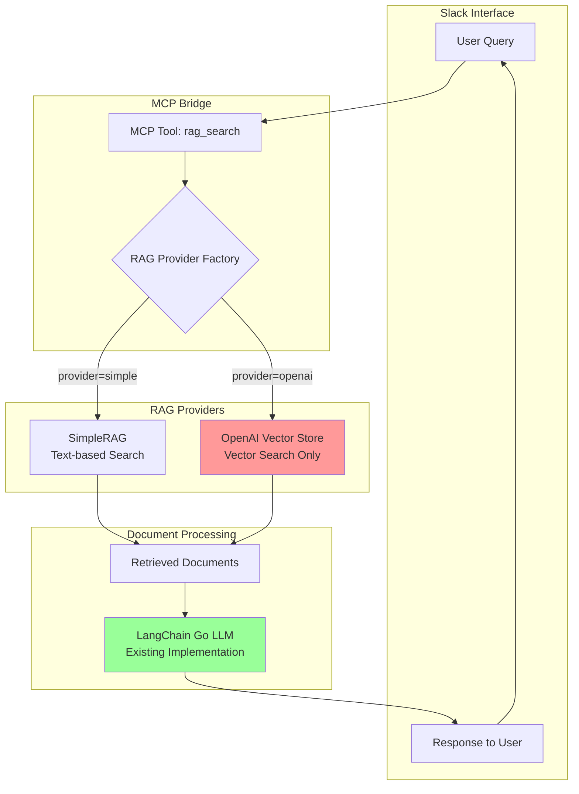
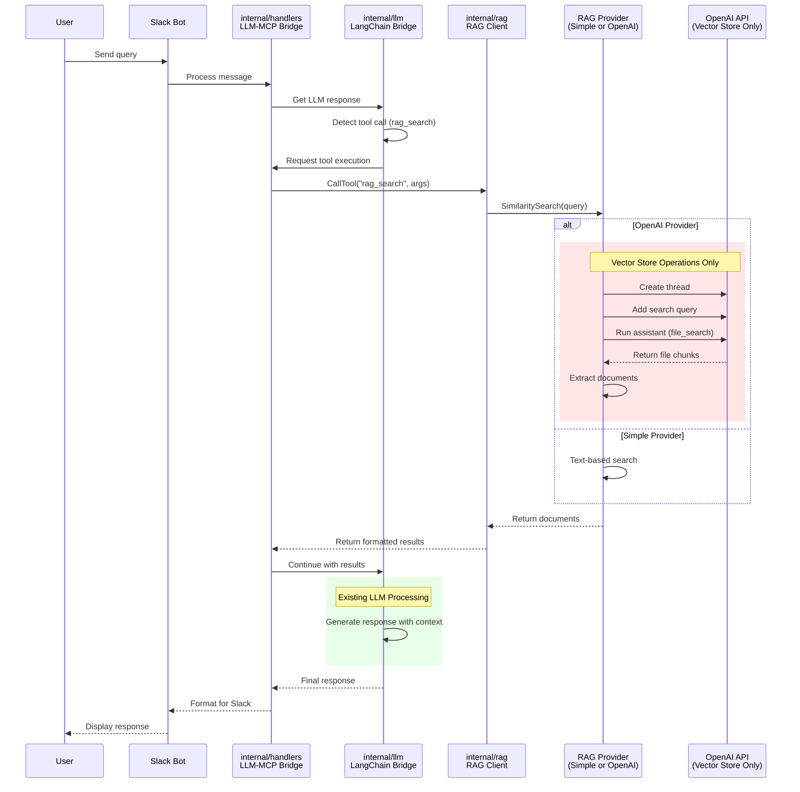
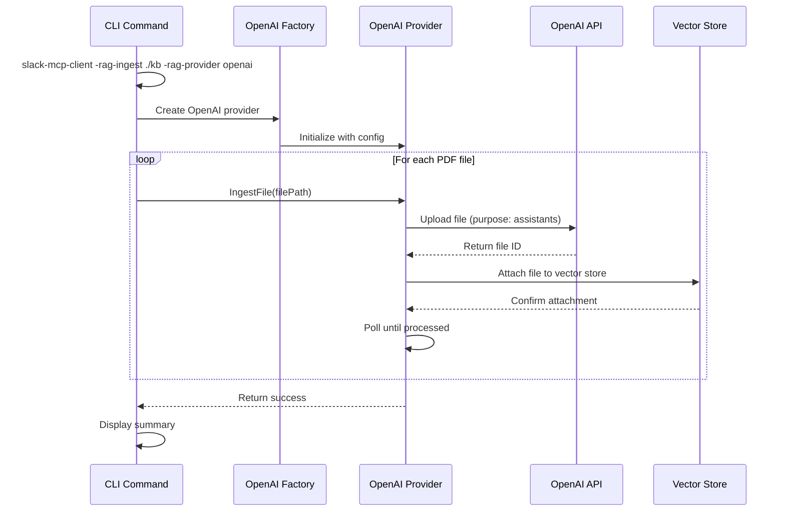
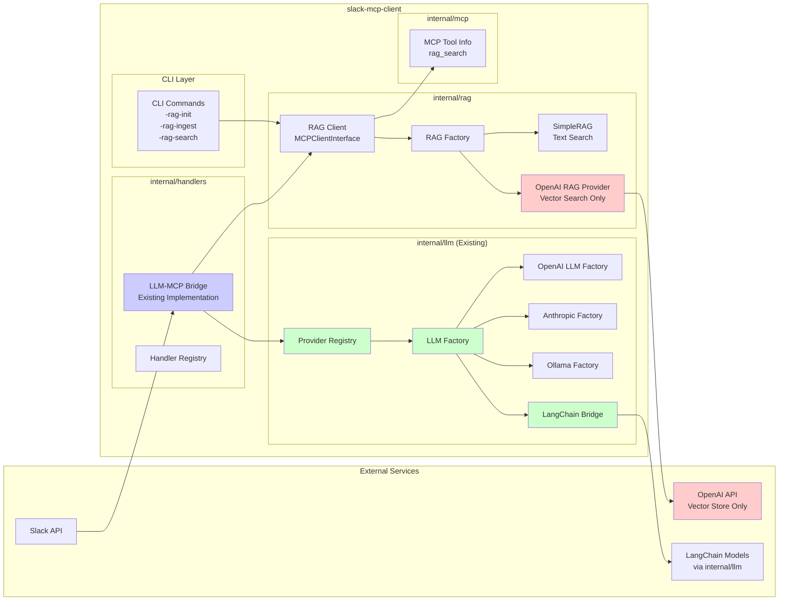

# RAG VectorStore Implementation Plan

## Overview

This document outlines the plan to enhance the current RAG system by adding support for OpenAI's vector store solution. Phase 1 will leverage OpenAI's Assistants API with file search capabilities, which provides a fully managed vector store, embeddings, and retrieval system. This approach minimizes implementation complexity while providing powerful vector search capabilities.

**Important**: This integration is purely for vector store functionality. The existing LangChain Go implementation handles all LLM/chat features. OpenAI will only be used for:
- Vector store creation and management
- File uploads and processing
- Vector-based similarity search
- Document retrieval

## Goals

1. **Leverage OpenAI's Vector Store**: Use OpenAI's Assistants API with file search for managed vector storage
2. **Simplify Implementation**: Eliminate the need to manage embeddings, vector storage, and similarity calculations
3. **Maintain Backward Compatibility**: Ensure existing JSON-based RAG continues to work
4. **Design for Extensibility**: Structure code to easily add other providers in future phases
5. **Provide Unified Interface**: Abstract OpenAI's API behind our existing RAG interfaces

## Architecture Design

### 1. Provider-Agnostic Interfaces

```go
// internal/rag/providers/interface.go
// Core interfaces that all providers must implement

import (
    "context"
    "time"
)

type VectorProvider interface {
    // Document Management
    IngestFile(ctx context.Context, filePath string, metadata map[string]string) (string, error)
    IngestFiles(ctx context.Context, filePaths []string, metadata map[string]string) ([]string, error)
    DeleteFile(ctx context.Context, fileID string) error
    ListFiles(ctx context.Context, limit int) ([]FileInfo, error)
    
    // Search Operations
    Search(ctx context.Context, query string, options SearchOptions) ([]SearchResult, error)
    
    // Lifecycle
    Initialize(ctx context.Context) error
    Close() error
}

type FileInfo struct {
    ID         string
    Name       string
    Size       int64
    UploadedAt time.Time
    Metadata   map[string]string
}

type SearchOptions struct {
    Limit      int
    MinScore   float32
    Metadata   map[string]string
}

type SearchResult struct {
    Content    string
    Score      float32
    FileID     string
    FileName   string
    Metadata   map[string]string
    Highlights []string
}
```

### 2. OpenAI Implementation (Vector Store Only)

```go
// internal/rag/providers/openai/provider.go
type OpenAIProvider struct {
    client        *openai.Client      // OpenAI client for vector store operations
    assistantID   string              // Assistant with file_search tool
    vectorStoreID string              // Vector store ID
    config        OpenAIConfig
}

// Implements VectorProvider interface - NO CHAT FUNCTIONALITY
func (o *OpenAIProvider) IngestFile(ctx context.Context, filePath string, metadata map[string]string) (string, error)
func (o *OpenAIProvider) Search(ctx context.Context, query string, options SearchOptions) ([]SearchResult, error)
// ... other interface methods

// internal/rag/providers/openai/adapter.go
// Adapts OpenAIProvider to existing RAGProvider interface for backward compatibility
type OpenAIRAGAdapter struct {
    provider *OpenAIProvider
}

// Implements RAGProvider interface (from interface.go) - ONLY for vector operations
// The returned documents are fed to LangChain Go for LLM processing
func (a *OpenAIRAGAdapter) AddDocuments(ctx context.Context, docs []schema.Document, options ...vectorstores.Option) ([]string, error)
func (a *OpenAIRAGAdapter) SimilaritySearch(ctx context.Context, query string, numDocuments int, options ...vectorstores.Option) ([]schema.Document, error)
```

### 3. Implementation Structure

```
internal/rag/              # ALL changes stay within this directory
├── interface.go          # Existing - enhance with VectorProvider interface
├── simple.go            # Existing - unchanged text-based implementation
├── client.go            # Existing - update to support provider selection
├── factory.go           # New - factory for creating RAG providers
├── openai_provider.go   # New - OpenAI vector store implementation
└── openai_adapter.go    # New - adapts OpenAI to RAGProvider interface

# NO changes to these directories:
internal/llm/             # Existing LLM providers stay unchanged
internal/handlers/        # LLM-MCP bridge stays unchanged
internal/mcp/             # MCP interfaces stay unchanged
```

**Important Design Decisions**:
1. Keep all vector store logic within `internal/rag/`
2. Reuse existing `MCPClientInterface` from `internal/mcp/`
3. No modifications to LLM providers in `internal/llm/`
4. No modifications to handlers in `internal/handlers/`
5. The RAG client continues to be treated as just another MCP client

### 4. Provider Registry Pattern

```go
// internal/rag/providers/registry.go
type ProviderRegistry struct {
    providers map[string]ProviderFactory
}

type ProviderFactory func(config map[string]interface{}) (VectorProvider, error)

func (r *ProviderRegistry) Register(name string, factory ProviderFactory) {
    r.providers[name] = factory
}

func (r *ProviderRegistry) Create(name string, config map[string]interface{}) (VectorProvider, error) {
    factory, exists := r.providers[name]
    if !exists {
        return nil, fmt.Errorf("unknown provider: %s", name)
    }
    return factory(config)
}

// Usage in factory.go
func init() {
    registry.Register("openai", NewOpenAIProvider)
    registry.Register("local", NewLocalProvider)    // Future
    registry.Register("pinecone", NewPineconeProvider) // Future
}
```

### 5. Configuration Schema

```yaml
rag:
  provider: "openai"  # Options: simple, openai
  database_path: "./knowledge.json"  # For backward compatibility
  
  # OpenAI Vector Store configuration (ONLY for vector operations)
  openai:
    api_key: "${OPENAI_API_KEY}"
    assistant_id: ""  # Optional: reuse existing assistant
    vector_store_id: ""  # Optional: reuse existing store
    
    # Search options
    search_options:
      max_results: 20  # Maximum search results
      include_annotations: true

# LLM configuration remains with LangChain Go
llm_providers:
  default: "openai"
  openai:
    api_key: "${OPENAI_API_KEY}"
    model: "gpt-4"
    # ... existing LangChain configuration
```

### 6. Data Flow Architecture

#### System Architecture Flowchart



#### Search Request Sequence Diagram (Using Existing Components)



#### File Ingestion Sequence Diagram



#### Component Architecture Diagram (Using Existing LLM Infrastructure)



### 7. Integration with Existing Architecture

**Key Points**:
1. **NO LLM reimplementation** - All LLM functionality stays in `internal/llm/`
2. **Use existing handlers** - The `LLMMCPBridge` in `internal/handlers/` continues to handle all LLM-MCP interactions
3. **RAG as MCP Client** - The RAG system (both SimpleRAG and OpenAI) implements `MCPClientInterface`
4. **Clean separation** - OpenAI vector store is ONLY used for document retrieval, never for chat/completion

**Integration Flow**:
```go
// internal/rag/client.go already implements MCPClientInterface
type Client struct {
    rag RAGProvider  // Can be SimpleRAG or OpenAIRAGProvider
}

func (c *Client) CallTool(ctx context.Context, toolName string, args map[string]interface{}) (string, error) {
    switch toolName {
    case "rag_search":
        // Use the configured provider (Simple or OpenAI)
        results := c.rag.SimilaritySearch(ctx, query, limit)
        // Return formatted results to LLM-MCP Bridge
        return formatResults(results), nil
    }
}

// The LLM-MCP Bridge in internal/handlers/ uses the results:
// 1. Receives search query from LLM
// 2. Calls RAG client's CallTool method
// 3. Gets document results
// 4. Passes results back to LLM (via internal/llm/) for response generation
```

## Implementation Phases

### Phase 1: OpenAI Vector Store Integration

1. **Core OpenAI Integration**
   - Set up OpenAI client with proper authentication
   - Create/retrieve assistant with file search capability
   - Implement vector store creation and management
   - Handle assistant lifecycle (create, update, delete)

2. **File Management**
   - File upload to OpenAI (PDF, TXT, MD, etc.)
   - Batch file upload for directories
   - File attachment to vector stores
   - File deletion and cleanup

3. **Search Functionality**
   - Create search queries using assistant threads
   - Parse file search results and annotations
   - Convert OpenAI responses to our Document format
   - Handle pagination for large result sets

4. **CLI Integration**
   - Enhance `-rag-ingest` to support OpenAI file upload
   - Add `-rag-provider` flag for provider selection
   - Implement `-rag-list`, `-rag-delete`, `-rag-stats` utility commands
   - Update `-rag-search` to use selected provider

5. **Configuration and Factory Updates**
   - Update RAG factory to support OpenAI provider
   - Add configuration validation
   - Implement provider switching logic
   - Ensure MCP `rag_search` tool uses configured provider

### Phase 2: Enhancement and Optimization

1. **Enhanced Search Capabilities**
   - Add metadata filtering
   - Implement search result ranking
   - Add support for search annotations
   - Implement search history tracking

2. **Performance Optimization**
   - Implement file caching to reduce re-uploads
   - Add batch operations for better performance
   - Optimize thread management
   - Add cost tracking and reporting

### Phase 3: Future Provider Support

1. **Abstract Common Patterns**
   - Extract interfaces for future providers
   - Create provider-agnostic file handling
   - Design unified search result format

2. **Add Alternative Providers**
   - Local vector stores (FAISS, ChromaDB)
   - Other cloud providers (Pinecone, Weaviate)
   - Hybrid search implementations

## Technical Considerations

### 1. OpenAI Assistant API Usage
- **Assistant Management**: Create one assistant per deployment, reuse across sessions
- **Vector Store Lifecycle**: One vector store per knowledge base, persistent across restarts
- **Thread Management**: Create new threads per search session for isolation
- **File Handling**: Track file IDs for updates and deletions

### 2. File Upload Strategy
- **Supported Formats**: PDF, TXT, MD, DOCX, HTML, JSON, etc.
- **Size Limits**: Handle OpenAI's file size limits (512MB per file)
- **Chunking**: Let OpenAI handle chunking with their optimized strategy
- **Deduplication**: Track uploaded files to avoid duplicates

### 3. Search Implementation
- **Query Construction**: Use natural language queries directly
- **Result Processing**: Extract content and citations from annotations
- **Relevance Scoring**: Use OpenAI's built-in ranking
- **Context Windows**: Respect token limits in responses

### 4. Cost Management
- **File Storage**: $0.20/GB/day for vector storage
- **Searches**: Included in assistant API token costs
- **Optimization**: Delete unused files, implement retention policies
- **Monitoring**: Track usage and provide cost estimates

### 5. Error Handling
- **Rate Limits**: Implement exponential backoff
- **API Errors**: Graceful fallback to text search
- **File Errors**: Validate before upload, handle failures
- **Quota Management**: Monitor and alert on usage limits

## CLI Changes

### Enhanced Existing Commands

The implementation will enhance the existing CLI flag structure rather than adding new MCP tools:

```bash
# Existing command - enhanced to support OpenAI
slack-mcp-client -rag-ingest ./kb -rag-db ./knowledge.json

# New flags for provider selection
slack-mcp-client -rag-ingest ./kb -rag-provider openai

# New utility commands following existing pattern
slack-mcp-client -rag-init -rag-provider openai        # Initialize vector store
slack-mcp-client -rag-list                             # List files in vector store
slack-mcp-client -rag-delete <file-ids>                # Delete files from vector store
slack-mcp-client -rag-stats                            # Show statistics

# Search with provider selection
slack-mcp-client -rag-search "query" -rag-provider openai
```

### New CLI Flags

```go
// cmd/main.go additions
ragProvider := flag.String("rag-provider", "simple", "RAG provider to use (simple, openai)")
ragInit := flag.Bool("rag-init", false, "Initialize vector store and exit")
ragList := flag.Bool("rag-list", false, "List files in vector store and exit")
ragDelete := flag.String("rag-delete", "", "Delete files from vector store (comma-separated IDs) and exit")
ragStats := flag.Bool("rag-stats", false, "Show RAG statistics and exit")
```

### MCP Tool Changes

The `rag_search` MCP tool remains the same for Slack integration, but internally uses the configured provider:

```json
{
  "rag_search": {
    "parameters": {
      "query": "string",
      "limit": "number"
    }
  }
}
```

### Configuration Examples

```json
// Minimal config (backward compatible)
{
  "rag": {
    "database_path": "./knowledge.json"
  }
}

// OpenAI Vector Store config
{
  "rag": {
    "provider": "openai",
    "openai": {
      "api_key": "${OPENAI_API_KEY}"
    }
  }
}

// Advanced OpenAI config
{
  "rag": {
    "provider": "openai",
    "database_path": "./knowledge.json",  // Keep for fallback
    "openai": {
      "api_key": "${OPENAI_API_KEY}",
      "assistant_id": "asst_xxx",  // Reuse existing
      "vector_store_id": "vs_xxx",  // Reuse existing
      "model": "gpt-4-turbo-preview",
      "search_options": {
        "max_results": 10
      }
    }
  }
}
```

## Migration Strategy

1. **Existing Users**: No action required, system continues with text-based search
2. **Opt-in OpenAI**: Users add `-rag-provider openai` flag or configure in config file
3. **Data Migration**: Use existing `-rag-ingest` command with OpenAI provider:
   ```bash
   slack-mcp-client -rag-ingest ./kb -rag-provider openai
   ```
4. **Dual Mode**: Can switch between providers using flags or configuration
5. **Rollback**: Simply omit `-rag-provider` flag to use default simple provider

## Implementation Details

### 1. Abstraction Benefits

The provider-agnostic interface design enables:

1. **Easy Provider Switching**: Change providers with configuration only
2. **Gradual Migration**: Run multiple providers simultaneously
3. **Testing Flexibility**: Mock providers for unit tests
4. **Feature Parity**: Common interface ensures consistent functionality

Example of adding a new provider:

```go
// internal/rag/providers/chromadb/provider.go
type ChromaDBProvider struct {
    client   *chromadb.Client
    collection string
}

func (c *ChromaDBProvider) IngestFile(ctx context.Context, filePath string, metadata map[string]string) (string, error) {
    // Read file
    content, err := readFile(filePath)
    if err != nil {
        return "", err
    }
    
    // Generate embeddings locally or via API
    embeddings := c.generateEmbeddings(content)
    
    // Store in ChromaDB
    id := generateID()
    err = c.client.Add(ctx, []chromadb.Document{
        {
            ID: id,
            Embedding: embeddings,
            Metadata: metadata,
            Content: content,
        },
    })
    
    return id, err
}

func (c *ChromaDBProvider) Search(ctx context.Context, query string, options SearchOptions) ([]SearchResult, error) {
    // Generate query embeddings
    queryEmbedding := c.generateEmbeddings(query)
    
    // Search ChromaDB
    results, err := c.client.Query(ctx, queryEmbedding, options.Limit)
    
    // Convert to common format
    return convertToSearchResults(results), err
}
```

### 2. Vector Store Initialization

The `-rag-init` command handles OpenAI Assistant and vector store setup using the official OpenAI Go SDK:

```go
// Triggered by: slack-mcp-client -rag-init -rag-provider openai
func handleRAGInit(provider string) error {
    if provider != "openai" {
        return fmt.Errorf("init only required for OpenAI provider")
    }
    
    client := openai.NewClient(
        option.WithAPIKey(os.Getenv("OPENAI_API_KEY")),
    )
    
    // Create assistant with file search tool
    assistant, err := client.Beta.Assistants.New(ctx, openai.BetaAssistantNewParams{
        Model: openai.ChatModelGPT4Turbo,
        Name: openai.String("RAG Assistant"),
        Description: openai.String("Assistant for document search and retrieval"),
        Tools: []openai.AssistantToolUnionParam{
            {
                OfFileSearchTool: &openai.FileSearchToolParam{
                    Type: openai.F("file_search"),
                },
            },
        },
    })
    if err != nil {
        return fmt.Errorf("failed to create assistant: %w", err)
    }
    
    // Create vector store
    vectorStore, err := client.VectorStores.New(ctx, openai.VectorStoreNewParams{
        Name: openai.String("Knowledge Base"),
    })
    if err != nil {
        return fmt.Errorf("failed to create vector store: %w", err)
    }
    
    // Update assistant with vector store
    _, err = client.Beta.Assistants.Update(ctx, assistant.ID, openai.BetaAssistantUpdateParams{
        ToolResources: &openai.BetaAssistantUpdateParamsToolResources{
            FileSearch: &openai.BetaAssistantUpdateParamsToolResourcesFileSearch{
                VectorStoreIDs: []string{vectorStore.ID},
            },
        },
    })
    if err != nil {
        return fmt.Errorf("failed to attach vector store: %w", err)
    }
    
    // Save IDs to config for reuse
    saveOpenAIConfig(assistant.ID, vectorStore.ID)
    
    fmt.Printf("Initialized OpenAI vector store:\n")
    fmt.Printf("  Assistant ID: %s\n", assistant.ID)
    fmt.Printf("  Vector Store ID: %s\n", vectorStore.ID)
    
    return nil
}
```

### 3. File Upload Process

Using the official OpenAI Go SDK for file uploads:

```go
// Upload file to OpenAI
func uploadFileToVectorStore(ctx context.Context, client *openai.Client, vectorStoreID, filePath string) error {
    // Open the file
    file, err := os.Open(filePath)
    if err != nil {
        return fmt.Errorf("failed to open file: %w", err)
    }
    defer file.Close()
    
    // Upload file with purpose "assistants"
    uploadedFile, err := client.Files.New(ctx, openai.FileNewParams{
        File:    file,
        Purpose: openai.FilePurposeAssistants,
    })
    if err != nil {
        return fmt.Errorf("failed to upload file: %w", err)
    }
    
    // Attach file to vector store
    vectorStoreFile, err := client.VectorStores.Files.New(ctx, vectorStoreID, openai.VectorStoreFileNewParams{
        FileID: openai.String(uploadedFile.ID),
    })
    if err != nil {
        return fmt.Errorf("failed to attach file to vector store: %w", err)
    }
    
    // Poll for completion
    for {
        vsFile, err := client.VectorStores.Files.Get(ctx, vectorStoreID, vectorStoreFile.ID)
        if err != nil {
            return fmt.Errorf("failed to check file status: %w", err)
        }
        
        if vsFile.Status == "completed" {
            break
        } else if vsFile.Status == "failed" {
            return fmt.Errorf("file processing failed")
        }
        
        time.Sleep(2 * time.Second)
    }
    
    return nil
}
```

### 4. Search Implementation (Vector Retrieval Only)

Using the official OpenAI Go SDK for vector store search - this ONLY retrieves relevant documents:

```go
// Search vector store using assistant - returns raw documents, NO chat generation
func searchVectorStore(ctx context.Context, client *openai.Client, assistantID, query string) ([]SearchResult, error) {
    // Create a new thread for the search
    thread, err := client.Beta.Threads.New(ctx, openai.BetaThreadNewParams{})
    if err != nil {
        return nil, fmt.Errorf("failed to create thread: %w", err)
    }
    
    // Add user's search query
    _, err = client.Beta.Threads.Messages.New(ctx, thread.ID, openai.BetaThreadMessageNewParams{
        Role: openai.F(openai.BetaThreadMessageNewParamsRoleUser),
        Content: openai.F([]openai.MessageContentPartParamUnion{
            {
                OfTextContentBlockParam: &openai.TextContentBlockParam{
                    Type: openai.F("text"),
                    Text: openai.String(query),
                },
            },
        }),
    })
    if err != nil {
        return nil, fmt.Errorf("failed to create message: %w", err)
    }
    
    // Run assistant with file_search tool to find relevant documents
    run, err := client.Beta.Threads.Runs.New(ctx, thread.ID, openai.BetaThreadRunNewParams{
        AssistantID: openai.String(assistantID),
        // Optional: Add instructions to return only citations/chunks
        Instructions: openai.String("Return only the relevant document chunks without any additional commentary."),
    })
    if err != nil {
        return nil, fmt.Errorf("failed to create run: %w", err)
    }
    
    // Poll for completion
    for {
        run, err = client.Beta.Threads.Runs.Get(ctx, thread.ID, run.ID)
        if err != nil {
            return nil, fmt.Errorf("failed to get run status: %w", err)
        }
        
        if run.Status == openai.RunStatusCompleted {
            break
        } else if run.Status == openai.RunStatusFailed {
            return nil, fmt.Errorf("run failed")
        }
        
        time.Sleep(1 * time.Second)
    }
    
    // Extract ONLY the file chunks/citations from the response
    messages, err := client.Beta.Threads.Messages.List(ctx, thread.ID, openai.BetaThreadMessageListParams{})
    if err != nil {
        return nil, fmt.Errorf("failed to list messages: %w", err)
    }
    
    // Parse and return document chunks - these will be fed to LangChain Go
    return extractDocumentChunks(messages), nil
}

// Extract only the document content from file search annotations
func extractDocumentChunks(messages pagination.CursorPage[openai.Message]) []SearchResult {
    var results []SearchResult
    
    // Extract file search annotations and citations
    for _, msg := range messages.Data {
        for _, content := range msg.Content {
            // Extract citations and file chunks
            if content.Type == "text" && content.Text.Annotations != nil {
                for _, annotation := range content.Text.Annotations {
                    if annotation.FileCitation != nil {
                        results = append(results, SearchResult{
                            Content:  annotation.Text,
                            FileID:   annotation.FileCitation.FileID,
                            // ... extract other metadata
                        })
                    }
                }
            }
        }
    }
    
    return results
}
```

### 5. File Management Operations

Additional CLI commands for managing vector store files:

```go
// List files in vector store
func listVectorStoreFiles(ctx context.Context, client *openai.Client, vectorStoreID string) error {
    // List all files in the vector store
    iter := client.VectorStores.Files.ListAutoPaging(ctx, vectorStoreID, openai.VectorStoreFileListParams{
        Limit: openai.Int(20),
    })
    
    fmt.Println("Files in vector store:")
    for iter.Next() {
        file := iter.Current()
        fmt.Printf("  - ID: %s, Status: %s\n", file.ID, file.Status)
    }
    
    if err := iter.Err(); err != nil {
        return fmt.Errorf("failed to list files: %w", err)
    }
    
    return nil
}

// Delete files from vector store
func deleteVectorStoreFiles(ctx context.Context, client *openai.Client, vectorStoreID string, fileIDs []string) error {
    for _, fileID := range fileIDs {
        // Remove from vector store
        _, err := client.VectorStores.Files.Delete(ctx, vectorStoreID, fileID)
        if err != nil {
            return fmt.Errorf("failed to remove file %s from vector store: %w", fileID, err)
        }
        
        // Delete the file itself
        _, err = client.Files.Delete(ctx, fileID)
        if err != nil {
            // Log but don't fail if file deletion fails
            fmt.Printf("Warning: failed to delete file %s: %v\n", fileID, err)
        }
    }
    
    return nil
}

// Get vector store statistics
func getVectorStoreStats(ctx context.Context, client *openai.Client, vectorStoreID string) error {
    // Get vector store details
    vs, err := client.VectorStores.Get(ctx, vectorStoreID)
    if err != nil {
        return fmt.Errorf("failed to get vector store: %w", err)
    }
    
    fmt.Printf("Vector Store Statistics:\n")
    fmt.Printf("  ID: %s\n", vs.ID)
    fmt.Printf("  Name: %s\n", vs.Name)
    fmt.Printf("  File Counts: %+v\n", vs.FileCounts)
    fmt.Printf("  Created At: %s\n", vs.CreatedAt)
    
    return nil
}
```

### 6. Adapter Pattern for Backward Compatibility

The adapter pattern ensures existing code continues to work with new providers:

```go
// internal/rag/providers/adapter.go
type ProviderAdapter struct {
    provider VectorProvider
}

// Adapts VectorProvider to existing RAGProvider interface
func (a *ProviderAdapter) AddDocuments(ctx context.Context, docs []schema.Document, options ...vectorstores.Option) ([]string, error) {
    // Convert documents to files
    tempFiles := make([]string, 0, len(docs))
    ids := make([]string, 0, len(docs))
    
    for _, doc := range docs {
        // Write document to temporary file
        tempFile := createTempFile(doc.PageContent)
        tempFiles = append(tempFiles, tempFile)
    }
    
    // Ingest files using provider
    fileIDs, err := a.provider.IngestFiles(ctx, tempFiles, extractMetadata(docs))
    if err != nil {
        return nil, err
    }
    
    // Cleanup temp files
    cleanupTempFiles(tempFiles)
    
    return fileIDs, nil
}

func (a *ProviderAdapter) SimilaritySearch(ctx context.Context, query string, numDocuments int, options ...vectorstores.Option) ([]schema.Document, error) {
    // Search using provider
    results, err := a.provider.Search(ctx, query, SearchOptions{
        Limit: numDocuments,
    })
    if err != nil {
        return nil, err
    }
    
    // Convert results to schema.Document
    docs := make([]schema.Document, 0, len(results))
    for _, result := range results {
        docs = append(docs, schema.Document{
            PageContent: result.Content,
            Metadata: convertMetadata(result.Metadata),
        })
    }
    
    return docs, nil
}
```

## Success Metrics

1. **Performance**: OpenAI search completes within 2-5 seconds
2. **Accuracy**: Vector search improves relevance significantly over text search
3. **Compatibility**: 100% backward compatibility with existing installations
4. **Cost**: Average cost ~$0.01 per search (including assistant tokens)
5. **Reliability**: 99.9% uptime with fallback to text search

## Risk Mitigation

1. **API Costs**: 
   - Implement cost tracking and alerts
   - Set file retention policies
   - Provide cost estimates before operations

2. **Service Dependency**:
   - Implement fallback to SimpleRAG
   - Cache search results
   - Handle API outages gracefully

3. **Data Privacy**:
   - Clear documentation about data upload
   - Option to exclude sensitive files
   - Implement data deletion tools

4. **Migration Risks**:
   - Thorough testing with real data
   - Gradual rollout strategy
   - Easy rollback mechanism

## Implementation Order

1. **Phase 1**: Core OpenAI vector store integration
2. **Phase 2**: Enhancement and optimization 
3. **Phase 3**: Additional provider support

## Dependencies

Add to `go.mod`:
```
require github.com/openai/openai-go v1.7.0
```

## Next Steps

1. Review and approve this plan
2. Set up OpenAI API access and test environment
3. Create development branch for OpenAI integration
4. Add OpenAI Go SDK dependency
5. Implement core OpenAI assistant wrapper
6. Test with sample documents before full integration

## Future Phases

After successful Phase 1 deployment:

1. **Phase 2**: Add local vector store options (ChromaDB, FAISS)
2. **Phase 3**: Implement hybrid search combining multiple providers
3. **Phase 4**: Add advanced features (clustering, deduplication)
4. **Phase 5**: Multi-modal support (images, audio)

## Provider Switching Example

The abstraction design makes switching providers straightforward:

```go
// internal/rag/factory.go
func (f *RAGFactory) CreateProvider(providerType ProviderType, config ProviderConfig) (RAGProvider, error) {
    // Get provider name from config
    providerName := config.Options["provider"].(string)
    
    // Create the vector provider
    vectorProvider, err := f.registry.Create(providerName, config.Options)
    if err != nil {
        return nil, fmt.Errorf("failed to create vector provider: %w", err)
    }
    
    // Initialize the provider
    if err := vectorProvider.Initialize(context.Background()); err != nil {
        return nil, fmt.Errorf("failed to initialize provider: %w", err)
    }
    
    // Wrap with adapter for backward compatibility
    return &ProviderAdapter{provider: vectorProvider}, nil
}

// Configuration-driven provider selection
// config.yaml
rag:
  provider: "openai"    # Switch to "chromadb", "pinecone", etc.
  openai:
    api_key: "${OPENAI_API_KEY}"
    
# After implementing ChromaDB provider, just change config:
rag:
  provider: "chromadb"
  chromadb:
    host: "localhost"
    port: 8000
    collection: "documents"
    embedding_model: "all-MiniLM-L6-v2"
```

This design ensures that:
1. No code changes required to switch providers
2. All providers implement the same interface
3. Existing code using RAGProvider continues to work
4. Easy to add new providers without modifying core logic