# Redis RAG Implementation Plan

## Overview

A high-performance Redis-based RAG implementation leveraging **LangChain Go's native Redis vector store support**. This provides true semantic search capabilities with vector embeddings, superior to both JSON and SQLite FTS5 approaches.

## Redis RAG Architecture

```mermaid
graph TD
    A["📱 Slack User"] --> B["🤖 Existing Slack Handler"]
    B --> C["🌉 Existing LLM-MCP Bridge"]
    C --> D{"Tool Needed?"}
    D -->|RAG Query| E["🔍 Redis RAG<br/>(Vector Search)"]
    D -->|Other| F["🛠️ Other MCP Tools"]
    D -->|No Tool| G["🧠 Direct LLM"]
    E --> H["🚀 Redis Vector Store<br/>(LangChain Go)"]
    H --> I["🎯 Similarity Search"]
    I --> J["📄 Ranked Results"]
    J --> G
    F --> G
    G --> K["💬 Response"]
    K --> B
    B --> A
    
    L["📁 PDF Files"] --> M["📊 Document Processor"]
    M --> N["🧩 Text Chunking"]
    N --> O["🔢 OpenAI Embeddings"]
    O --> P["💾 Redis Storage"]
    P --> H
```



## Performance Advantages

### **Vector Search vs Traditional Search**

| Feature | JSON (Current) | SQLite FTS5 | **Redis Vector** |
|---------|---------------|-------------|------------------|
| **Search Type** | Substring match | Keyword search | **Semantic similarity** |
| **Understanding** | None | Basic | **Contextual meaning** |
| **Query Flexibility** | Exact terms | Boolean operators | **Natural language** |
| **Multilingual** | No | Limited | **Yes (embeddings)** |
| **Synonym Support** | No | Manual | **Automatic** |
| **Performance** | O(n) linear | O(log n) | **O(log n) + semantic** |

### **Real-World Benefits**

```bash
# Traditional search limitations:
Query: "profit margins declining"
JSON/SQLite: Must contain exact words "profit", "margins", "declining"

# Redis vector search power:
Query: "profit margins declining" 
Redis: Finds documents about:
- "revenue decreasing"
- "profitability challenges" 
- "financial performance down"
- "earnings under pressure"
```

## LangChain Go Integration

### **Native Redis Vector Store**

LangChain Go provides **first-class Redis support** via `vectorstores/redisvector`:

```go
import (
    "github.com/tmc/langchaingo/vectorstores/redisvector"
    "github.com/tmc/langchaingo/embeddings/openai"
    "github.com/redis/go-redis/v9"
)

// Native LangChain Go Redis vector store
type RedisRAG struct {
    vectorStore  *redisvector.Store
    embeddings   *openai.EmbeddingModel
    redisClient  *redis.Client
}
```

### **Key Advantages of LangChain Integration**

1. ✅ **Native Support** - Official Redis vector store implementation
2. ✅ **Embedding Models** - Built-in OpenAI, Hugging Face, local model support
3. ✅ **Similarity Search** - Cosine, Euclidean, dot product similarity
4. ✅ **Metadata Filtering** - Advanced filtering capabilities
5. ✅ **Async Operations** - Non-blocking vector operations
6. ✅ **Production Ready** - Battle-tested in enterprise environments

## Implementation Architecture

### **Core Components**

```go
// internal/rag/redis.go
package rag

import (
    "context"
    "github.com/tmc/langchaingo/vectorstores/redisvector"
    "github.com/tmc/langchaingo/embeddings/openai"
    "github.com/tmc/langchaingo/schema"
    "github.com/redis/go-redis/v9"
)

type RedisRAG struct {
    vectorStore   *redisvector.Store
    embeddings    *openai.EmbeddingModel
    redisClient   *redis.Client
    indexName     string
}

type RedisConfig struct {
    Addr         string `json:"redis_addr"`
    Password     string `json:"redis_password"`
    DB           int    `json:"redis_db"`
    IndexName    string `json:"redis_index"`
    OpenAIKey    string `json:"openai_api_key"`
    EmbedModel   string `json:"embedding_model"`
    ChunkSize    int    `json:"chunk_size"`
    ChunkOverlap int    `json:"chunk_overlap"`
}
```

### **Document Ingestion Pipeline**

```go
func (r *RedisRAG) IngestPDF(filePath string) error {
    // 1. Extract text using existing LangChain PDF loader
    documents, err := r.loadPDF(filePath)
    if err != nil {
        return err
    }

    // 2. Chunk documents
    chunker := textsplitter.NewRecursiveCharacter()
    chunker.ChunkSize = r.config.ChunkSize
    chunker.ChunkOverlap = r.config.ChunkOverlap
    
    chunks, err := chunker.SplitDocuments(documents)
    if err != nil {
        return err
    }

    // 3. Generate embeddings and store in Redis
    ctx := context.Background()
    _, err = r.vectorStore.AddDocuments(ctx, chunks)
    return err
}
```

### **Semantic Search Implementation**

```go
func (r *RedisRAG) Search(query string, limit int) ([]Document, error) {
    ctx := context.Background()
    
    // Perform semantic similarity search
    results, err := r.vectorStore.SimilaritySearch(
        ctx, 
        query,
        limit,
        redisvector.WithScoreThreshold(0.7), // Similarity threshold
        redisvector.WithFilter(map[string]interface{}{
            // Optional metadata filtering
            "file_type": "pdf",
        }),
    )
    
    if err != nil {
        return nil, err
    }
    
    // Convert to our Document format
    documents := make([]Document, len(results))
    for i, result := range results {
        documents[i] = Document{
            Content:  result.PageContent,
            Source:   result.Metadata["source"].(string),
            Score:    result.Score,
            Metadata: result.Metadata,
        }
    }
    
    return documents, nil
}
```

## Redis Configuration & Setup

### **Redis Stack Installation**

```bash
# Option 1: Docker (recommended for development)
docker run -d --name redis-stack \
  -p 6379:6379 \
  -p 8001:8001 \
  redis/redis-stack:latest

# Option 2: Redis Cloud (recommended for production)
# Sign up at https://redis.com/try-free/

# Option 3: Local installation
brew install redis-stack
redis-stack-server
```

### **Vector Index Configuration**

```go
// Redis vector index configuration
func (r *RedisRAG) createIndex() error {
    indexDef := redisvector.IndexDefinition{
        IndexName: r.indexName,
        Schema: []redisvector.FieldSchema{
            {
                FieldName: "content_vector",
                FieldType: "VECTOR",
                VectorArgs: redisvector.VectorArgs{
                    Algorithm: "FLAT", // or "HNSW" for large datasets
                    Attributes: map[string]interface{}{
                        "TYPE":         "FLOAT32",
                        "DIM":          1536, // OpenAI ada-002 dimensions
                        "DISTANCE_METRIC": "COSINE",
                    },
                },
            },
            {
                FieldName: "content",
                FieldType: "TEXT",
            },
            {
                FieldName: "source",
                FieldType: "TEXT",
            },
            {
                FieldName: "file_type",
                FieldType: "TAG",
            },
        },
    }
    
    return r.vectorStore.CreateIndex(context.Background(), indexDef)
}
```

## Configuration Integration

### **Enhanced Config Structure**

```json
{
  "llm_provider": "openai",
  "openai_api_key": "sk-...",
  "rag_enabled": true,
  "rag_provider": "redis",
  "rag_config": {
    "redis_addr": "localhost:6379",
    "redis_password": "",
    "redis_db": 0,
    "redis_index": "documents",
    "openai_api_key": "sk-...",
    "embedding_model": "text-embedding-ada-002",
    "chunk_size": 1000,
    "chunk_overlap": 200,
    "similarity_threshold": 0.7,
    "max_results": 5
  },
  "custom_prompt": "Search the knowledge base first using rag_search before responding...",
  "slack_bot_token": "xoxb-...",
  "slack_app_token": "xapp-..."
}
```

## CLI Commands

### **Enhanced CLI Support**

```bash
# Ingest documents with Redis backend
./slack-mcp-client --rag-ingest ./docs --rag-provider redis

# Semantic search
./slack-mcp-client --rag-search "revenue declining profitability" --rag-provider redis

# Index management
./slack-mcp-client --rag-reindex --rag-provider redis
./slack-mcp-client --rag-stats --rag-provider redis

# Migration from JSON/SQLite
./slack-mcp-client --rag-migrate --from json --to redis
```

## Advanced Features

### **Hybrid Search (Best of Both Worlds)**

```go
// Combine vector similarity with keyword filtering
func (r *RedisRAG) HybridSearch(query string, filters map[string]interface{}) ([]Document, error) {
    // 1. Vector similarity search
    vectorResults, err := r.vectorStore.SimilaritySearch(
        context.Background(),
        query,
        20, // Get more candidates
        redisvector.WithFilter(filters),
    )
    
    // 2. Keyword re-ranking for precision
    rerankedResults := r.rerankByKeywords(vectorResults, query)
    
    // 3. Return top N results
    return rerankedResults[:min(len(rerankedResults), 5)], nil
}
```

### **Multi-Modal Support**

```go
// Support for different content types
type ContentType string

const (
    ContentTypePDF        ContentType = "pdf"
    ContentTypeText       ContentType = "text"
    ContentTypeMarkdown   ContentType = "markdown"
    ContentTypeSpreadsheet ContentType = "spreadsheet"
)

func (r *RedisRAG) IngestWithType(filePath string, contentType ContentType) error {
    switch contentType {
    case ContentTypePDF:
        return r.ingestPDF(filePath)
    case ContentTypeSpreadsheet:
        return r.ingestSpreadsheet(filePath)
    case ContentTypeMarkdown:
        return r.ingestMarkdown(filePath)
    default:
        return r.ingestText(filePath)
    }
}
```

### **Real-Time Updates**

```go
// File watcher for automatic re-ingestion
func (r *RedisRAG) StartFileWatcher(watchDir string) error {
    watcher, err := fsnotify.NewWatcher()
    if err != nil {
        return err
    }
    
    go func() {
        for {
            select {
            case event := <-watcher.Events:
                if event.Op&fsnotify.Write == fsnotify.Write {
                    r.IngestFile(event.Name)
                }
            }
        }
    }()
    
    return watcher.Add(watchDir)
}
```

## Migration Strategy

### **Phase 1: Parallel Implementation**
- Implement Redis RAG alongside existing JSON system
- Use `rag_provider` config to switch between backends
- Maintain backward compatibility

### **Phase 2: Performance Testing**
- A/B test search quality between JSON and Redis
- Measure query response times and memory usage
- Optimize Redis index configuration

### **Phase 3: Migration Tools**
- Automated migration from JSON to Redis
- Bulk import with progress tracking
- Verification tools to ensure data integrity

### **Phase 4: Production Deployment**
- Switch default to Redis backend
- Monitor performance and error rates
- Gradual rollout with fallback options

## Performance Benchmarks

### **Expected Performance Gains**

| Metric | JSON (Current) | Redis Vector |
|--------|---------------|--------------|
| **Search Quality** | Basic substring | **Semantic understanding** |
| **Query Speed** | 50-200ms | **5-20ms** |
| **Memory Usage** | 350KB+ (linear) | **<10MB (indexed)** |
| **Scalability** | ~1K documents | **100K+ documents** |
| **Multi-language** | No | **Yes** |
| **Synonym Support** | No | **Automatic** |

### **Real-World Search Examples**

```bash
# Query: "How is our European market performing?"
# JSON: Looks for "European" + "market" + "performing" (exact)
# Redis: Understands context, finds:
#   - "EMEA sales declining"
#   - "EU revenue challenges" 
#   - "Continental performance metrics"
#   - "European demand analysis"
```

## Deployment Options

### **Development**
- **Docker Compose**: Redis Stack + application
- **Local Redis**: Simple setup for testing
- **Mock Mode**: In-memory vector store for unit tests

### **Production**
- **Redis Cloud**: Managed service with high availability
- **Redis Cluster**: Self-hosted with sharding
- **Redis Sentinel**: High availability configuration

## Cost Analysis

### **Redis Cloud Pricing** (Production Ready)
- **Free Tier**: 30MB RAM, perfect for testing
- **Small Production**: $5-15/month for 100MB-1GB
- **Enterprise**: $50-200/month for 10GB+ with clustering

### **Infrastructure Costs**
- **Self-hosted**: EC2 t3.medium ($25/month) + storage
- **Managed**: Redis Cloud standard plans
- **Hybrid**: Local development + cloud production

## Security Considerations

### **Data Protection**
- **TLS Encryption**: All Redis communications encrypted
- **Authentication**: Redis AUTH + ACL controls
- **Network Security**: VPC isolation in production
- **API Keys**: Secure OpenAI key management

### **Compliance**
- **Data Residency**: Choose Redis regions for compliance
- **Audit Logging**: Track all document access and searches
- **Data Retention**: Configurable TTL for sensitive documents

## Next Steps

### **Quick Start** (Immediate)
1. **Setup Redis Stack**: Local Docker installation
2. **Configure OpenAI**: API key for embeddings
3. **Implement Core**: `internal/rag/redis.go` with LangChain Go
4. **Test Migration**: Convert existing knowledge base

### **Production Readiness** (Next Phase)
1. **Redis Cloud**: Production deployment setup
2. **Monitoring**: Performance metrics and alerting
3. **Backup Strategy**: Vector index backup and restore
4. **Load Testing**: Simulate production query volumes

### **Advanced Features** (Future)
1. **Hybrid Search**: Combine vector + keyword search
2. **Multi-Modal**: Images, tables, structured data
3. **Real-Time**: File watching and auto-updates
4. **Analytics**: Search patterns and usage metrics

## Comparison Summary

| Approach | Implementation Effort | Search Quality | Performance | Scalability |
|----------|---------------------|----------------|-------------|-------------|
| **JSON (Current)** | ✅ Complete | ⚠️ Basic | ⚠️ Slow | ❌ Limited |
| **SQLite FTS5** | 🔨 Moderate | ✅ Good | ✅ Fast | ✅ Medium |
| **Redis Vector** | 🔧 Advanced | 🚀 **Excellent** | 🚀 **Fastest** | 🚀 **High** |

**Recommendation**: Redis vector search provides the best long-term solution for semantic RAG capabilities, especially with LangChain Go's native support making implementation straightforward. 
