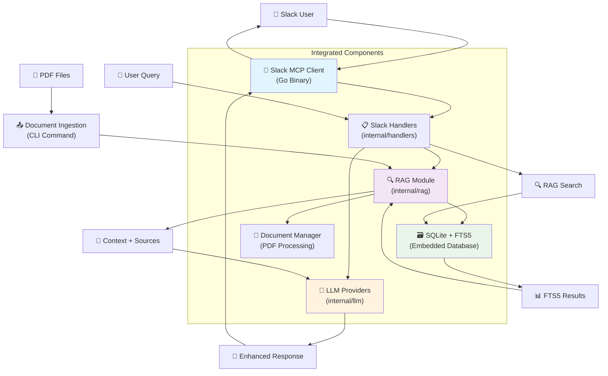

# Native Go SQLite RAG Implementation

## Overview

This document outlines the implementation plan for integrating SQLite + FTS5 RAG capabilities directly into the Go Slack MCP Client, providing a high-performance, single-binary solution for document search and knowledge base functionality.

## Architecture Design

### Native Integration Architecture



### Design Principles

1. **Single Binary** - Everything embedded in your Go application
2. **Zero External Dependencies** - No separate database servers or MCP servers
3. **Consistent Architecture** - Follows existing `internal/` package structure
4. **CLI Integration** - Document ingestion through CLI commands
5. **Performance First** - Direct database access, no network overhead

## Component Structure

### RAG Module Structure (`internal/rag/`)

```
internal/rag/
├── manager.go       # Main RAG coordinator using LangChain chains
├── retriever.go     # SQLite-based LangChain retriever implementation
├── vectorstore.go   # Custom SQLite vector store for LangChain
├── loader.go        # Document loaders (PDF, TXT, MD) using LangChain
├── chain.go         # LangChain QA chains and prompt templates
└── types.go         # Common types & LangChain integration
```

### Integration Points

#### With Existing Handlers (`internal/handlers/`)

```go
type SlackHandler struct {
    // existing fields...
    ragManager *rag.Manager  // New RAG integration
}

// New methods:
// - HandleRAGQuery(query string) (*rag.SearchResult, error)
// - EnhancePromptWithContext(prompt string, context []rag.Document) string
```

#### With LLM Providers (`internal/llm/`)

```go
// Enhance existing LLM calls with RAG context
type LLMRequest struct {
    // existing fields...
    RAGContext []rag.Document `json:"rag_context,omitempty"`
}
```

#### With Configuration (`internal/config/`)

```go
type Config struct {
    // existing fields...
    RAG RAGConfig `yaml:"rag"`
}

type RAGConfig struct {
    Enabled      bool   `yaml:"enabled"`
    DatabasePath string `yaml:"database_path"`
    ChunkSize    int    `yaml:"chunk_size"`
    ChunkOverlap int    `yaml:"chunk_overlap"`
    MaxResults   int    `yaml:"max_results"`
}
```

## Database Schema

### Core Tables

```sql
-- Documents table with FTS5 for full-text search
CREATE VIRTUAL TABLE documents USING fts5(
    id UNINDEXED,
    title,
    content,
    file_path UNINDEXED,
    file_hash UNINDEXED,
    chunk_index UNINDEXED,
    page_number UNINDEXED,
    created_at UNINDEXED,
    updated_at UNINDEXED,
    metadata UNINDEXED  -- JSON for additional fields
);

-- Metadata table for document tracking
CREATE TABLE document_files (
    id INTEGER PRIMARY KEY,
    file_path TEXT UNIQUE,
    file_hash TEXT,
    file_size INTEGER,
    mime_type TEXT,
    processed_at DATETIME,
    chunk_count INTEGER,
    status TEXT  -- 'processed', 'failed', 'pending'
);

-- Search analytics (optional)
CREATE TABLE search_queries (
    id INTEGER PRIMARY KEY,
    query TEXT,
    results_count INTEGER,
    user_id TEXT,
    timestamp DATETIME
);
```

### Indexes for Performance

```sql
-- FTS5 automatically creates search indexes
-- Additional indexes for metadata queries
CREATE INDEX idx_document_files_hash ON document_files(file_hash);
CREATE INDEX idx_document_files_status ON document_files(status);
CREATE INDEX idx_search_queries_timestamp ON search_queries(timestamp);
```

## CLI Commands Integration

Add new commands to your existing CLI:

```bash
# Document management
./slack-mcp-client rag ingest --path /path/to/pdfs
./slack-mcp-client rag ingest --file document.pdf
./slack-mcp-client rag status
./slack-mcp-client rag search "query text"
./slack-mcp-client rag list-documents
./slack-mcp-client rag rebuild-index

# Database management  
./slack-mcp-client rag export --output backup.db
./slack-mcp-client rag import --input backup.db
./slack-mcp-client rag vacuum  # Optimize database
./slack-mcp-client rag stats   # Show database statistics
```

## Implementation Phases

### Phase 1: LangChain Vector Store Implementation

**Goals**: SQLite-based LangChain vector store
**Timeline**: 1-2 weeks

**Tasks**:
1. Create `internal/rag/` module implementing LangChain interfaces
2. Implement `SQLiteVectorStore` using FTS5 for similarity search
3. Create LangChain-compatible retriever interface
4. Add basic CLI commands for document management
5. Add configuration support

**Deliverables**:
- SQLite vector store implements `vectorstores.VectorStore` interface
- Basic document storage and retrieval works
- CLI can ingest documents using LangChain loaders
- Unit tests with in-memory SQLite

### Phase 2: Document Processing with LangChain

**Goals**: Document ingestion using LangChain loaders and splitters
**Timeline**: 1 week

**Tasks**:
1. Integrate LangChain document loaders (PDF, text, markdown)
2. Use LangChain text splitters for smart chunking
3. Add duplicate detection and incremental updates
4. Implement document metadata tracking
5. Error handling and recovery

**Deliverables**:
- PDF processing using `documentloaders.NewPDF()`
- Smart chunking with `textsplitters.NewRecursiveCharacter()`
- Support for multiple document formats via LangChain loaders
- Duplicate detection prevents reprocessing

### Phase 3: QA Chain Integration

**Goals**: LangChain QA chains for Slack integration
**Timeline**: 1 week

**Tasks**:
1. Implement LangChain QA chains (`chains.LoadStuffQA`)
2. Create custom prompt templates for Slack context
3. Integrate with existing Slack handlers
4. Add source citation and formatting for Slack
5. Configuration for different chain types

**Deliverables**:
- Slack commands use LangChain QA chains
- Automatic retrieval + generation in one call
- Source citations in Slack responses
- Configurable prompt templates

### Phase 4: Advanced LangChain Features

**Goals**: Production enhancements using LangChain capabilities
**Timeline**: 1-2 weeks

**Tasks**:
1. Add LangChain conversation memory for multi-turn chats
2. Implement different chain types (map-reduce, refine)
3. Add LangChain evaluation and monitoring
4. Use LangChain callbacks for observability
5. Performance optimization and caching

**Deliverables**:
- Conversation memory for context-aware responses
- Multiple QA chain strategies available
- LangChain evaluation metrics
- Production-grade performance monitoring

## Dependencies Required

### Go Modules

```go
// go.mod additions (leveraging existing LangChain)
require (
    github.com/tmc/langchaingo v0.1.13         // Already in use - LangChain Go
    github.com/mattn/go-sqlite3 v1.14.18       // SQLite driver with FTS5
    github.com/gabriel-vasile/mimetype v1.4.3  // MIME type detection
    github.com/spf13/cobra v1.8.0              // CLI commands (if not already present)
)
```

### Build Tags

```bash
# Ensure CGO is enabled for SQLite
go build -tags="fts5" ./cmd/slack-mcp-client
```

### LangChain Components Used

This implementation leverages the following LangChain Go components:

1. **Document Loaders**
   - `documentloaders.NewPDF(r io.ReaderAt, size int64, opts ...PDFOptions)` - PDF document processing
   - `documentloaders.NewText(r io.Reader)` - Plain text files
   - `documentloaders.NewCSV(r io.Reader, columns ...string)` - CSV files
   - `documentloaders.NewHTML(r io.Reader)` - HTML content

2. **Text Splitters**
   - `textsplitter.NewRecursiveCharacter()` - Smart text chunking
   - `textsplitter.WithChunkSize()` - Configurable chunk sizes
   - `textsplitter.WithChunkOverlap()` - Context preservation

3. **Vector Stores Interface**
   - `vectorstores.VectorStore` - Standard interface implementation
   - `vectorstores.ToRetriever()` - Convert to retriever interface
   - Custom SQLite backend with FTS5

4. **Chains & Prompts**
   - `chains.LoadStuffQA()` - Question-answering chain
   - `chains.LoadMapReduceQA()` - For large documents
   - `prompts.NewPromptTemplate()` - Custom prompt templates
   - `schema.ChainValues` - Chain input/output handling

5. **Retrievers**
   - `schema.Retriever` - Standard retriever interface
   - Configurable top-k document retrieval
   - Filter support for metadata

6. **Memory & Callbacks**
   - `memory.NewConversationBuffer()` - Chat history
   - `callbacks.LogHandler` - Request/response logging
   - `callbacks.StdOutHandler` - Debug output

### PDF Processing Notes

**LangChain Go PDF Support:** YES, LangChain Go provides built-in PDF parsing through `documentloaders.NewPDF()`.

**API Signature:**
```go
func NewPDF(r io.ReaderAt, size int64, opts ...PDFOptions) PDF
```

**Key Details:**
- Uses [`ledongthuc/pdf`](https://github.com/ledongthuc/pdf) library internally
- Requires `io.ReaderAt` (not `io.Reader`) and file size
- Supports password-protected PDFs with `documentloaders.WithPassword()` option
- Extracts text content with page metadata

**Known Limitations:**
- Some PDF files may fail with "malformed PDF" errors ([Issue #348](https://github.com/tmc/langchaingo/issues/348))
- Complex layouts, embedded images, or certain PDF encodings may not extract cleanly
- Less robust than some alternative PDF libraries (e.g., `pdfcpu`)

**Recommended Approach:**
```go
// Use LangChain PDF loader as primary method
func (m *Manager) IngestPDF(filePath string) error {
    file, err := os.Open(filePath)
    if err != nil {
        return err
    }
    defer file.Close()
    
    info, err := file.Stat()
    if err != nil {
        return err
    }
    
    // Try LangChain PDF loader first
    loader := documentloaders.NewPDF(file, info.Size())
    docs, err := loader.LoadAndSplit(context.Background(), m.textSplitter)
    
    if err != nil {
        log.Warnf("LangChain PDF loader failed for %s: %v, trying fallback", filePath, err)
        // Implement fallback using alternative PDF library if needed
        return m.fallbackPDFProcessing(filePath)
    }
    
    return m.vectorStore.AddDocuments(context.Background(), docs)
}
```

## Type Definitions

### Core Types with LangChain Integration

```go
package rag

import (
    "context"
    "time"
    
    "github.com/tmc/langchaingo/schema"
    "github.com/tmc/langchaingo/vectorstores"
    "github.com/tmc/langchaingo/chains"
)

// Manager coordinates RAG operations using LangChain
type Manager struct {
    vectorStore vectorstores.VectorStore
    retriever   schema.Retriever
    qaChain     chains.Chain
    config      Config
}

// SQLiteVectorStore implements LangChain's VectorStore interface
type SQLiteVectorStore struct {
    db     *sql.DB
    config VectorStoreConfig
}

// Implements vectorstores.VectorStore interface
func (s *SQLiteVectorStore) AddDocuments(ctx context.Context, docs []schema.Document, options ...vectorstores.Option) error {
    // Implementation using SQLite FTS5
}

func (s *SQLiteVectorStore) SimilaritySearch(ctx context.Context, query string, numDocuments int, options ...vectorstores.Option) ([]schema.Document, error) {
    // Implementation using SQLite FTS5 search
}

// Document extends LangChain Document with metadata
type Document struct {
    schema.Document                    // Embedded LangChain document
    ID          string            `json:"id"`
    FileHash    string            `json:"file_hash"`
    ChunkIndex  int               `json:"chunk_index"`
    PageNumber  int               `json:"page_number"`
    CreatedAt   time.Time         `json:"created_at"`
    UpdatedAt   time.Time         `json:"updated_at"`
    Score       float64           `json:"score"`
}

// SearchRequest wraps LangChain retrieval parameters
type SearchRequest struct {
    Query       string            `json:"query"`
    K           int               `json:"k"`           // Number of documents to retrieve
    Filters     map[string]any    `json:"filters"`
    MinScore    float64           `json:"min_score"`
}

// SearchResult contains LangChain documents with metadata
type SearchResult struct {
    Documents   []schema.Document `json:"documents"`
    Total       int               `json:"total"`
    Query       string            `json:"query"`
    Took        time.Duration     `json:"took"`
}

// DocumentFile tracks original files
type DocumentFile struct {
    ID          int               `json:"id"`
    FilePath    string            `json:"file_path"`
    FileHash    string            `json:"file_hash"`
    FileSize    int64             `json:"file_size"`
    MimeType    string            `json:"mime_type"`
    ProcessedAt time.Time         `json:"processed_at"`
    ChunkCount  int               `json:"chunk_count"`
    Status      string            `json:"status"`
}

// Config for RAG system
type Config struct {
    DatabasePath    string `yaml:"database_path"`
    ChunkSize       int    `yaml:"chunk_size"`
    ChunkOverlap    int    `yaml:"chunk_overlap"`
    MaxResults      int    `yaml:"max_results"`
    PromptTemplate  string `yaml:"prompt_template"`
}
```

## Slack Integration Examples

### Query Enhancement Flow

```
User: "What's our vacation policy?"
↓
1. Slack handler receives message
2. Detect potential RAG query (contains policy keywords)
3. Search RAG: documents MATCH 'vacation policy'
4. Get top 3 relevant chunks
5. Enhance LLM prompt: "Based on these policies: [context], answer: What's our vacation policy?"
6. Send to LLM with enhanced context
7. Return answer with source citations
```

### LangChain Integration Examples

```go
import (
    "context"
    "github.com/tmc/langchaingo/chains"
    "github.com/tmc/langchaingo/prompts"
    "github.com/tmc/langchaingo/schema"
)

// Initialize RAG Manager with LangChain components
func NewRAGManager(dbPath string, llmProvider llms.Model) (*rag.Manager, error) {
    // Create SQLite vector store
    vectorStore, err := rag.NewSQLiteVectorStore(dbPath)
    if err != nil {
        return nil, err
    }
    
    // Create retriever from vector store
    retriever := vectorstores.ToRetriever(vectorStore, 5) // Top 5 documents
    
    // Create QA chain with custom prompt template
    promptTemplate := prompts.NewPromptTemplate(
        `Based on the following context, answer the question. If you cannot answer based on the context, say so.

Context:
{{.context}}

Question: {{.question}}

Answer:`,
        []string{"context", "question"},
    )
    
    qaChain := chains.LoadStuffQA(llmProvider, promptTemplate)
    
    return &rag.Manager{
        vectorStore: vectorStore,
        retriever:   retriever,
        qaChain:     qaChain,
    }, nil
}

// Enhanced Slack handler using LangChain QA chain
func (h *SlackHandler) processMessage(ctx context.Context, message string) (*llm.Response, error) {
    // Check if message might benefit from RAG context
    if h.shouldUseRAG(message) {
        // Use LangChain QA chain for retrieval + generation
        result, err := h.ragManager.qaChain.Call(ctx, schema.ChainValues{
            "question": message,
        })
        if err == nil {
            // Extract answer from chain result
            if answer, ok := result["text"].(string); ok {
                return &llm.Response{
                    Content: answer,
                    Sources: h.extractSources(result),
                }, nil
            }
        }
    }
    
    // Fallback to normal processing
    return h.llmProvider.Generate(ctx, message)
}

// Document ingestion using LangChain loaders
func (m *Manager) IngestPDF(ctx context.Context, filePath string) error {
    // Open PDF file - LangChain Go requires io.ReaderAt and file size
    file, err := os.Open(filePath)
    if err != nil {
        return fmt.Errorf("failed to open PDF: %w", err)
    }
    defer file.Close()
    
    // Get file info for size
    info, err := file.Stat()
    if err != nil {
        return fmt.Errorf("failed to get file info: %w", err)
    }
    
    // Create LangChain PDF loader - uses ledongthuc/pdf internally
    loader := documentloaders.NewPDF(file, info.Size())
    
    // Load and split documents using LangChain text splitter
    splitter := textsplitter.NewRecursiveCharacter(
        textsplitter.WithChunkSize(m.config.ChunkSize),
        textsplitter.WithChunkOverlap(m.config.ChunkOverlap),
    )
    
    docs, err := loader.LoadAndSplit(ctx, splitter)
    if err != nil {
        return fmt.Errorf("failed to load PDF: %w", err)
    }
    
    // Add documents to vector store
    return m.vectorStore.AddDocuments(ctx, docs)
}
```

## Performance Considerations

### Database Optimization

```sql
-- Optimize FTS5 performance
PRAGMA journal_mode = WAL;           -- Better concurrency
PRAGMA synchronous = NORMAL;         -- Balanced safety/performance
PRAGMA cache_size = 10000;           -- Larger cache
PRAGMA temp_store = memory;          -- Use memory for temp operations
```

### Memory Management

```go
// Connection pooling
type SQLiteManager struct {
    db          *sql.DB
    maxConns    int
    maxIdleTime time.Duration
}

func (m *SQLiteManager) init() error {
    m.db.SetMaxOpenConns(m.maxConns)
    m.db.SetMaxIdleConns(m.maxConns / 2)
    m.db.SetConnMaxIdleTime(m.maxIdleTime)
    return nil
}
```

### Search Optimization

```go
// Prepared statements for common queries
type PreparedQueries struct {
    searchDocuments *sql.Stmt
    insertDocument  *sql.Stmt
    getDocument     *sql.Stmt
}

func (m *SQLiteManager) prepareStatements() error {
    var err error
    m.queries.searchDocuments, err = m.db.Prepare(`
        SELECT id, title, content, file_path, chunk_index, 
               bm25(documents) as score
        FROM documents 
        WHERE documents MATCH ? 
        ORDER BY score 
        LIMIT ?
    `)
    return err
}
```

## Testing Strategy

### LangChain Integration Tests

```go
func TestSQLiteVectorStore_LangChainInterface(t *testing.T) {
    ctx := context.Background()
    
    // Test LangChain vector store interface
    store, err := rag.NewSQLiteVectorStore(":memory:")
    require.NoError(t, err)
    
    // Test adding documents using LangChain schema
    docs := []schema.Document{
        {
            PageContent: "Vacation policy allows 25 days per year",
            Metadata: map[string]any{
                "source": "hr-policy.pdf",
                "page":   1,
            },
        },
    }
    
    err = store.AddDocuments(ctx, docs)
    require.NoError(t, err)
    
    // Test similarity search
    results, err := store.SimilaritySearch(ctx, "vacation policy", 5)
    require.NoError(t, err)
    assert.Len(t, results, 1)
    assert.Contains(t, results[0].PageContent, "vacation")
}

func TestQAChain_Integration(t *testing.T) {
    ctx := context.Background()
    
    // Setup RAG manager with mock LLM
    mockLLM := &llms.MockModel{}
    manager, err := rag.NewRAGManager(":memory:", mockLLM)
    require.NoError(t, err)
    
    // Add test documents
    docs := []schema.Document{
        {PageContent: "Company vacation policy: 25 days per year"},
    }
    err = manager.vectorStore.AddDocuments(ctx, docs)
    require.NoError(t, err)
    
    // Test QA chain
    result, err := manager.qaChain.Call(ctx, schema.ChainValues{
        "question": "How many vacation days do we get?",
    })
    require.NoError(t, err)
    assert.Contains(t, result["text"], "25 days")
}
```

### Document Processing Tests

```go
func TestDocumentLoaders_LangChain(t *testing.T) {
    ctx := context.Background()
    
    // Test PDF loader integration
    testPDF := createTestPDF(t) // Helper to create test PDF
    
    loader := documentloaders.NewPDF(testPDF)
    splitter := textsplitters.NewRecursiveCharacter(
        textsplitters.WithChunkSize(500),
        textsplitters.WithChunkOverlap(50),
    )
    
    docs, err := loader.LoadAndSplit(ctx, splitter)
    require.NoError(t, err)
    assert.Greater(t, len(docs), 0)
    
    // Verify document structure
    for _, doc := range docs {
        assert.NotEmpty(t, doc.PageContent)
        assert.Contains(t, doc.Metadata, "source")
    }
}
```
```

## Migration Strategy

### Deployment Steps

1. **Feature Flag Implementation**
   ```go
   type Config struct {
       RAG RAGConfig `yaml:"rag"`
   }
   
   type RAGConfig struct {
       Enabled bool `yaml:"enabled" default:"false"`
   }
   ```

2. **Gradual Rollout**
   - Deploy with RAG disabled by default
   - Enable for testing/staging environments
   - Gradually enable for production users

3. **Backward Compatibility**
   - All existing functionality continues to work
   - RAG is purely additive
   - No breaking changes to existing APIs

4. **Data Migration**
   ```bash
   # If migrating from external systems
   ./slack-mcp-client rag import --input old-knowledge.db
   ./slack-mcp-client rag rebuild-index
   ```

## Monitoring and Observability

### Metrics to Track

```go
type RAGMetrics struct {
    SearchCount         int64
    AvgSearchTime       time.Duration
    CacheHitRate        float64
    DocumentCount       int64
    DatabaseSize        int64
    ErrorRate           float64
}
```

### Health Checks

```go
func (m *SQLiteManager) HealthCheck() error {
    // Test database connectivity
    if err := m.db.Ping(); err != nil {
        return fmt.Errorf("database ping failed: %w", err)
    }
    
    // Test FTS5 functionality
    _, err := m.db.Exec("SELECT * FROM documents WHERE documents MATCH 'test' LIMIT 1")
    if err != nil {
        return fmt.Errorf("FTS5 test failed: %w", err)
    }
    
    return nil
}
```

## Benefits of LangChain Integration

### Why LangChain for RAG Implementation

1. **Proven Abstractions**: LangChain provides battle-tested interfaces for document loading, text splitting, and retrieval that handle edge cases and optimizations.

2. **Standardized Components**: Using `vectorstores.VectorStore` and `schema.Retriever` interfaces ensures compatibility with future LangChain ecosystem improvements.

3. **Advanced Chain Types**: Access to sophisticated QA strategies like `LoadStuffQA`, `LoadMapReduceQA`, and `LoadRefineQA` without custom implementation.

4. **Prompt Engineering**: Built-in prompt templates and chain composition for RAG workflows, with easy customization for Slack-specific formatting.

5. **Future-Proof**: As LangChain Go evolves, you'll automatically get access to new loaders, splitters, and chain types.

6. **Reduced Development Time**: Leveraging existing document loaders and text splitters saves significant development effort compared to building from scratch.

7. **Testing & Reliability**: LangChain components are extensively tested across different document types and use cases.

### Architecture Benefits

- **Single Binary**: SQLite backend maintains your zero-dependency deployment model
- **Performance**: Direct database access with no network overhead between components  
- **Consistency**: RAG module follows your existing `internal/` package structure
- **Flexibility**: Easy to swap LLM providers while keeping the same RAG infrastructure
- **Observability**: LangChain callbacks provide built-in monitoring and logging

This implementation plan provides a comprehensive roadmap for integrating SQLite-based RAG capabilities directly into your Go Slack MCP Client using LangChain, maintaining your single-binary deployment model while leveraging proven document processing and retrieval patterns. 
