# SQLite RAG Implementation & Migration Plan

## Overview

A comprehensive migration plan from the current JSON-based RAG system to a high-performance SQLite implementation with FTS5 full-text search. This upgrade addresses scalability limitations while maintaining backward compatibility.

## SQLite Migration Architecture

```mermaid
graph TD
    A["📱 Slack User"] --> B["🤖 Existing Slack Handler"]
    B --> C["🌉 Existing LLM-MCP Bridge"]
    C --> D{"Tool Needed?"}
    D -->|RAG Query| E["🔍 SQLite RAG<br/>(FTS5 Search)"]
    D -->|Other| F["🛠️ Other MCP Tools"]
    D -->|No Tool| G["🧠 Direct LLM"]
    E --> H["⚡ SQLite Database<br/>+ FTS5 Index"]
    H --> I["📄 Ranked Results"]
    I --> G
    F --> G
    G --> J["💬 Response"]
    J --> B
    B --> A
    
    K["📁 PDF Files"] --> L["⚡ Batch Ingestion"]
    L --> E
    M["📄 JSON Migration"] --> N["🔄 Auto-Migration"]
    N --> E
```



## Key Improvements Over JSON Implementation

### **Performance Gains**
- **Search Speed**: O(log n) FTS5 indexing vs O(n) linear scan
- **Memory Usage**: <50MB regardless of document count vs linear growth
- **Document Capacity**: 50,000+ documents vs ~1,000 practical limit
- **Query Performance**: <100ms search time vs degrading performance

### **Feature Enhancements**
- **Advanced Search**: Boolean operators (AND, OR, NOT), phrase matching
- **Faceted Search**: Filter by file type, date range, source
- **Relevance Scoring**: BM25 ranking algorithm built into FTS5
- **Pagination**: Efficient offset/limit for large result sets

## **LangChain Go Integration Analysis**

Based on research of the LangChain Go ecosystem, here are the available SQLite integration options:

### **Option 1: Direct SQLite Integration** ⭐ *RECOMMENDED*

**Advantages:**
- **Zero LangChain Dependencies**: Use standard `database/sql` with SQLite driver
- **Full Control**: Direct SQL queries, custom schema design, optimal performance
- **Mature Ecosystem**: `github.com/mattn/go-sqlite3` is the standard Go SQLite driver
- **FTS5 Support**: Built-in full-text search with SQLite FTS5 extension

**Implementation:**
```go
import (
    "database/sql"
    _ "github.com/mattn/go-sqlite3"
)

// Custom RAG implementation with direct SQLite access
type SQLiteRAG struct {
    db *sql.DB
}
```

### **Option 2: LangChain Go SQLite Memory + Custom Vector Store** 

**Status**: **CONFIRMED** - LangChain Go has limited SQLite support

**Available in LangChain Go:**
- ✅ **SqliteChatMessageHistory** (`github.com/tmc/langchaingo/memory/sqlite3`)
- ✅ **SQL Database Toolkit** (general SQLite database operations)
- ❌ **NO SQLite Vector Store** (not available in LangChain Go)

**Hybrid Approach:**
```go
import (
    "github.com/tmc/langchaingo/memory/sqlite3"
    "database/sql"
    _ "github.com/mattn/go-sqlite3"
)

// Use LangChain for memory + custom vector storage
type HybridRAG struct {
    memory   *sqlite3.SqliteChatMessageHistory
    vectorDB *sql.DB // Custom vector implementation
}
```

### **Option 3: Third-Party Go Vector Libraries**

**Alternative Libraries:**
- **`chand1012/vectorgo`** - Pure Go SQLite-powered vector database
- **Custom Implementation** - Build vector similarity search on top of SQLite

**Advantages:**
- **Specialized**: Purpose-built for vector operations
- **Go Native**: No Python dependencies

### **Recommendation: Pure Go Implementation**

For this project, **Option 1 (Direct SQLite)** is recommended because:

1. **Existing Pattern**: Current JSON implementation is custom, not LangChain-dependent
2. **Performance Focus**: Direct SQL access provides optimal performance
3. **Full Feature Control**: Can implement exactly the features needed
4. **Maintenance**: Fewer dependencies, easier to debug and maintain
5. **LangChain Go Limitations**: No vector store support for SQLite

## Database Schema Design

```sql
-- Core documents table with metadata
CREATE TABLE documents (
    id INTEGER PRIMARY KEY,
    content_hash TEXT UNIQUE NOT NULL,
    file_path TEXT NOT NULL,
    file_name TEXT NOT NULL,
    file_type TEXT NOT NULL,
    chunk_index INTEGER NOT NULL,
    content TEXT NOT NULL,
    metadata JSON NOT NULL,
    ingested_at DATETIME DEFAULT CURRENT_TIMESTAMP,
    updated_at DATETIME DEFAULT CURRENT_TIMESTAMP
);

-- FTS5 virtual table for full-text search
CREATE VIRTUAL TABLE documents_fts USING fts5(
    content, 
    file_name, 
    metadata,
    content=documents,
    content_rowid=id,
    tokenize='porter'
);

-- Performance indexes
CREATE INDEX idx_documents_file_path ON documents(file_path);
CREATE INDEX idx_documents_file_type ON documents(file_type);
CREATE INDEX idx_documents_hash ON documents(content_hash);
CREATE INDEX idx_documents_ingested ON documents(ingested_at);

-- Triggers to keep FTS5 in sync
CREATE TRIGGER documents_fts_insert AFTER INSERT ON documents BEGIN
    INSERT INTO documents_fts(rowid, content, file_name, metadata) 
    VALUES (NEW.id, NEW.content, NEW.file_name, NEW.metadata);
END;

CREATE TRIGGER documents_fts_delete AFTER DELETE ON documents BEGIN
    DELETE FROM documents_fts WHERE rowid = OLD.id;
END;

CREATE TRIGGER documents_fts_update AFTER UPDATE ON documents BEGIN
    UPDATE documents_fts SET 
        content = NEW.content,
        file_name = NEW.file_name,
        metadata = NEW.metadata
    WHERE rowid = NEW.id;
END;
```

## Implementation Architecture

### **Core Components**

```go
// SQLite RAG implementation
type SQLiteRAG struct {
    db       *sql.DB
    dbPath   string
    config   RAGConfig
    logger   *log.Logger
}

type RAGConfig struct {
    ChunkSize      int      `json:"chunk_size"`
    ChunkOverlap   int      `json:"chunk_overlap"`
    EnableFTS5     bool     `json:"enable_fts5"`
    IndexFields    []string `json:"index_fields"`
    MaxResults     int      `json:"max_results"`
    EnableMetrics  bool     `json:"enable_metrics"`
}

type SearchOptions struct {
    Query         string            `json:"query"`
    Filters       map[string]string `json:"filters"`
    Limit         int              `json:"limit"`
    Offset        int              `json:"offset"`
    SortBy        string           `json:"sort_by"`
    SortOrder     string           `json:"sort_order"`
    EnableSnippet bool             `json:"enable_snippet"`
}

type SearchResult struct {
    Documents    []Document        `json:"documents"`
    TotalCount   int              `json:"total_count"`
    QueryTime    time.Duration    `json:"query_time"`
    Facets       map[string][]Facet `json:"facets,omitempty"`
}

type Document struct {
    ID          int64             `json:"id"`
    Content     string            `json:"content"`
    Snippet     string            `json:"snippet,omitempty"`
    Metadata    map[string]string `json:"metadata"`
    Score       float64           `json:"score"`
    IngestedAt  time.Time         `json:"ingested_at"`
}
```

### **Advanced Search Implementation**

```go
// Enhanced search with FTS5 features
func (r *SQLiteRAG) Search(opts SearchOptions) (*SearchResult, error) {
    startTime := time.Now()
    
    // Build FTS5 query with ranking
    ftsQuery := r.buildFTS5Query(opts.Query)
    
    // Construct SQL with filters and pagination
    baseQuery := `
        SELECT d.id, d.content, d.metadata, d.ingested_at,
               snippet(documents_fts, 0, '<mark>', '</mark>', '...', 32) as snippet,
               rank as score
        FROM documents_fts fts
        JOIN documents d ON d.id = fts.rowid
        WHERE documents_fts MATCH ?`
    
    // Add filters
    args := []interface{}{ftsQuery}
    if opts.Filters != nil {
        for key, value := range opts.Filters {
            baseQuery += fmt.Sprintf(" AND json_extract(d.metadata, '$.%s') = ?", key)
            args = append(args, value)
        }
    }
    
    // Add ordering and pagination
    baseQuery += ` ORDER BY rank LIMIT ? OFFSET ?`
    args = append(args, opts.Limit, opts.Offset)
    
    rows, err := r.db.Query(baseQuery, args...)
    if err != nil {
        return nil, fmt.Errorf("search query failed: %w", err)
    }
    defer rows.Close()
    
    var documents []Document
    for rows.Next() {
        var doc Document
        var metadataJSON string
        
        err := rows.Scan(&doc.ID, &doc.Content, &metadataJSON, 
                        &doc.IngestedAt, &doc.Snippet, &doc.Score)
        if err != nil {
            return nil, err
        }
        
        json.Unmarshal([]byte(metadataJSON), &doc.Metadata)
        documents = append(documents, doc)
    }
    
    // Get total count for pagination
    totalCount, _ := r.getSearchCount(ftsQuery, opts.Filters)
    
    return &SearchResult{
        Documents:  documents,
        TotalCount: totalCount,
        QueryTime:  time.Since(startTime),
    }, nil
}

// Build optimized FTS5 query
func (r *SQLiteRAG) buildFTS5Query(query string) string {
    // Handle phrase queries
    if strings.Contains(query, `"`) {
        return query // Pass through phrase queries as-is
    }
    
    // Split into terms and build OR query for flexibility
    terms := strings.Fields(strings.ToLower(query))
    if len(terms) == 1 {
        return terms[0]
    }
    
    // Build query like: term1 AND (term2 OR term3 OR term4)
    return fmt.Sprintf(`%s AND (%s)`, terms[0], strings.Join(terms[1:], " OR "))
}
```

## Migration Strategy

### **Backward Compatibility Interface**

```go
// Unified interface supporting both implementations
type RAGInterface interface {
    Search(query string, limit int) []Document
    SearchWithOptions(opts SearchOptions) (*SearchResult, error)
    IngestPDF(filePath string) error
    IngestDirectory(dirPath string) (int, error)
    GetDocumentCount() int
    GetStats() RAGStats
}

// Factory function with automatic migration
func NewRAG(dbPath string, config RAGConfig) (RAGInterface, error) {
    // Detect existing format
    if strings.HasSuffix(dbPath, ".json") {
        // Check if SQLite migration is requested
        sqlitePath := strings.Replace(dbPath, ".json", ".db", 1)
        if config.EnableMigration {
            return migrateJSONToSQLite(dbPath, sqlitePath, config)
        }
        return NewSimpleRAG(dbPath), nil
    }
    
    return NewSQLiteRAG(dbPath, config)
}

// Automatic migration from JSON to SQLite
func migrateJSONToSQLite(jsonPath, sqlitePath string, config RAGConfig) (*SQLiteRAG, error) {
    // Load existing JSON data
    jsonRAG := NewSimpleRAG(jsonPath)
    documents := jsonRAG.getAllDocuments()
    
    // Create new SQLite instance
    sqliteRAG, err := NewSQLiteRAG(sqlitePath, config)
    if err != nil {
        return nil, err
    }
    
    // Migrate documents with progress tracking
    log.Printf("Migrating %d documents from JSON to SQLite...", len(documents))
    for i, doc := range documents {
        if err := sqliteRAG.insertDocument(doc); err != nil {
            return nil, fmt.Errorf("migration failed at document %d: %w", i, err)
        }
        
        if (i+1)%100 == 0 {
            log.Printf("Migrated %d/%d documents", i+1, len(documents))
        }
    }
    
    // Backup original JSON file
    backupPath := jsonPath + ".backup"
    os.Rename(jsonPath, backupPath)
    log.Printf("Migration complete. Original file backed up to %s", backupPath)
    
    return sqliteRAG, nil
}
```

### **Configuration Migration**

```json
{
  "llm_providers": {
    "openai": {
      "type": "openai",
      "model": "gpt-4o",
      "rag_enabled": true,
      "rag_database": "./knowledge.db",
      "rag_config": {
        "chunk_size": 1000,
        "chunk_overlap": 200,
        "enable_fts5": true,
        "max_results": 10,
        "enable_migration": true,
        "index_fields": ["content", "file_name", "metadata"]
      }
    }
  }
}
```

## CLI Commands Enhancement

```go
// Enhanced CLI with SQLite-specific features
var (
    ragIngest     = flag.String("rag-ingest", "", "Ingest files from directory")
    ragSearch     = flag.String("rag-search", "", "Search RAG database")
    ragDatabase   = flag.String("rag-db", "./knowledge.db", "Path to RAG database")
    ragMigrate    = flag.Bool("rag-migrate", false, "Migrate from JSON to SQLite")
    ragOptimize   = flag.Bool("rag-optimize", false, "Optimize database (VACUUM, ANALYZE)")
    ragStats      = flag.Bool("rag-stats", false, "Show database statistics")
    ragExport     = flag.String("rag-export", "", "Export to JSON file")
)

// Enhanced search with filters
func handleRAGSearch(query string) {
    rag, err := NewSQLiteRAG(*ragDatabase, defaultConfig)
    if err != nil {
        log.Fatalf("Failed to open database: %v", err)
    }
    defer rag.Close()
    
    opts := SearchOptions{
        Query:         query,
        Limit:         10,
        EnableSnippet: true,
    }
    
    result, err := rag.SearchWithOptions(opts)
    if err != nil {
        log.Fatalf("Search failed: %v", err)
    }
    
    fmt.Printf("Search results for: %s\n", query)
    fmt.Printf("Found %d documents (%v):\n\n", result.TotalCount, result.QueryTime)
    
    for i, doc := range result.Documents {
        fmt.Printf("--- Result %d (Score: %.2f) ---\n", i+1, doc.Score)
        if doc.Snippet != "" {
            fmt.Printf("Content: %s\n", doc.Snippet)
        } else {
            fmt.Printf("Content: %.200s...\n", doc.Content)
        }
        if fileName, ok := doc.Metadata["file_name"]; ok {
            fmt.Printf("Source: %s\n", fileName)
        }
        fmt.Printf("Ingested: %s\n", doc.IngestedAt.Format("2006-01-02 15:04"))
        fmt.Println()
    }
}
```

## Performance Optimizations

### **Database Tuning**

```sql
-- SQLite performance settings
PRAGMA journal_mode = WAL;           -- Write-ahead logging
PRAGMA synchronous = NORMAL;         -- Balance safety and speed  
PRAGMA cache_size = -64000;          -- 64MB cache
PRAGMA foreign_keys = ON;            -- Referential integrity
PRAGMA optimize;                     -- Query planner optimization

-- FTS5 optimization
INSERT INTO documents_fts(documents_fts, rank) VALUES('automerge', 8);
INSERT INTO documents_fts(documents_fts) VALUES('optimize');
```

### **Batch Operations**

```go
// Efficient batch ingestion
func (r *SQLiteRAG) IngestBatch(files []string) error {
    tx, err := r.db.Begin()
    if err != nil {
        return err
    }
    defer tx.Rollback()
    
    stmt, err := tx.Prepare(`
        INSERT INTO documents (content_hash, file_path, file_name, file_type, 
                             chunk_index, content, metadata) 
        VALUES (?, ?, ?, ?, ?, ?, ?)`)
    if err != nil {
        return err
    }
    defer stmt.Close()
    
    for _, filePath := range files {
        chunks, err := r.processFile(filePath)
        if err != nil {
            log.Printf("Error processing %s: %v", filePath, err)
            continue
        }
        
        for i, chunk := range chunks {
            hash := r.hashContent(chunk.Content)
            metadata, _ := json.Marshal(chunk.Metadata)
            
            _, err := stmt.Exec(hash, filePath, filepath.Base(filePath),
                              filepath.Ext(filePath), i, chunk.Content, metadata)
            if err != nil {
                return err
            }
        }
    }
    
    return tx.Commit()
}
```

## Monitoring & Analytics

```go
type RAGStats struct {
    DocumentCount    int64         `json:"document_count"`
    DatabaseSize     int64         `json:"database_size_bytes"`
    IndexSize        int64         `json:"index_size_bytes"`
    AvgQueryTime     time.Duration `json:"avg_query_time"`
    PopularQueries   []QueryStat   `json:"popular_queries"`
    FileTypeCounts   map[string]int `json:"file_type_counts"`
    LastIngestion    time.Time     `json:"last_ingestion"`
}

type QueryStat struct {
    Query      string        `json:"query"`
    Count      int          `json:"count"`
    AvgTime    time.Duration `json:"avg_time"`
    LastUsed   time.Time     `json:"last_used"`
}

func (r *SQLiteRAG) GetStats() RAGStats {
    // Implementation for comprehensive statistics
}
```

## Future Extensions

### **Advanced Features Ready for Implementation**
- **Vector Embeddings**: Add embedding column for semantic search
- **Multi-tenant**: Namespace isolation with tenant_id
- **Real-time Sync**: File watching and incremental updates
- **Backup/Restore**: Automated backup procedures
- **Replication**: Master-slave setup for high availability

### **Integration Points**
- **Slack Bot**: Enhanced search commands with filters
- **Web UI**: Management interface for document lifecycle
- **API Server**: RESTful endpoints for external integration
- **Monitoring**: Prometheus metrics and health checks

This SQLite implementation provides a solid foundation for enterprise-scale RAG while maintaining the simplicity and integration patterns of the original JSON approach.
