# Simplified SQLite RAG Implementation

## Overview

A streamlined approach to adding RAG capabilities to the existing Slack MCP Client, leveraging current LangChain integration and avoiding over-engineering.

## Simplified Architecture

```mermaid
graph TD
    A["📱 Slack User"] --> B["🤖 Existing Slack Handler"]
    B --> C{"RAG Query?"}
    C -->|Yes| D["🔍 RAG Store<br/>(SQLite FTS5)"]
    C -->|No| E["🧠 Existing LLM Provider"]
    D --> F["📄 Context Documents"]
    F --> E
    E --> G["💬 Enhanced Response"]
    G --> B
    B --> A
    
    H["📁 PDF Files"] --> I["👀 Simple File Watcher"]
    I --> D
```



## Key Simplifications

1. **Single RAG component** instead of multiple managers/processors
2. **Leverage existing LLM provider pattern** 
3. **Simple file watcher** without job queues
4. **Minimal configuration** using existing config system
5. **Basic CLI integration** using existing flag parser

## Implementation

### 1. Extend Existing LLM Provider Interface

```go
// Add to internal/llm/provider.go
type LLMProvider interface {
    GenerateCompletion(ctx context.Context, prompt string, options ProviderOptions) (*llms.ContentChoice, error)
    GenerateChatCompletion(ctx context.Context, messages []RequestMessage, options ProviderOptions) (*llms.ContentChoice, error)
    
    // New RAG capability
    GenerateRAGCompletion(ctx context.Context, query string, ragStore RAGStore) (*llms.ContentChoice, error)
}

// Simple RAG store interface
type RAGStore interface {
    Search(ctx context.Context, query string, limit int) ([]Document, error)
    AddDocument(ctx context.Context, content string, metadata map[string]any) error
    ProcessFile(ctx context.Context, filePath string) error
    Close() error  // For proper database cleanup
}
```

### 2. Simple RAG Store Implementation

```go
// internal/rag/store.go
package rag

import (
    "context"
    "database/sql"
    "encoding/json"
    _ "github.com/mattn/go-sqlite3"
    "github.com/tmc/langchaingo/documentloaders"
    "github.com/tmc/langchaingo/textsplitter"
)

type Store struct {
    db       *sql.DB
    splitter textsplitter.TextSplitter
}

func NewStore(dbPath string) (*Store, error) {
    db, err := sql.Open("sqlite3", dbPath+"?_fts=fts5")
    if err != nil {
        return nil, err
    }
    
    // Simple schema
    _, err = db.Exec(`
        CREATE VIRTUAL TABLE IF NOT EXISTS documents USING fts5(
            content,
            metadata UNINDEXED
        )
    `)
    if err != nil {
        return nil, err
    }
    
    splitter := textsplitter.NewRecursiveCharacter(
        textsplitter.WithChunkSize(1000),
        textsplitter.WithChunkOverlap(200),
    )
    
    return &Store{db: db, splitter: splitter}, nil
}

func (s *Store) Search(ctx context.Context, query string, limit int) ([]Document, error) {
    rows, err := s.db.QueryContext(ctx, 
        "SELECT content, metadata FROM documents WHERE documents MATCH ? ORDER BY bm25(documents) LIMIT ?",
        query, limit)
    if err != nil {
        return nil, err
    }
    defer rows.Close()
    
    var docs []Document
    for rows.Next() {
        var content, metadataJSON string
        if err := rows.Scan(&content, &metadataJSON); err != nil {
            continue
        }
        
        var metadata map[string]any
        json.Unmarshal([]byte(metadataJSON), &metadata)
        
        docs = append(docs, Document{
            Content:  content,
            Metadata: metadata,
        })
    }
    return docs, nil
}

func (s *Store) ProcessFile(ctx context.Context, filePath string) error {
    // Remove existing documents for this file
    metadataFilter := map[string]any{"file_path": filePath}
    metadataJSON, _ := json.Marshal(metadataFilter)
    s.db.ExecContext(ctx, "DELETE FROM documents WHERE metadata = ?", metadataJSON)
    
    // Load PDF using existing LangChain loader
    file, err := os.Open(filePath)
    if err != nil {
        return err
    }
    defer file.Close()
    
    info, _ := file.Stat()
    loader := documentloaders.NewPDF(file, info.Size())
    
    docs, err := loader.LoadAndSplit(ctx, s.splitter)
    if err != nil {
        return err
    }
    
    // Store documents
    for i, doc := range docs {
        metadata := map[string]any{
            "file_path":   filePath,
            "chunk_index": i,
        }
        metadataJSON, _ := json.Marshal(metadata)
        
        _, err = s.db.ExecContext(ctx,
            "INSERT INTO documents (content, metadata) VALUES (?, ?)",
            doc.PageContent, metadataJSON)
        if err != nil {
            return err
        }
    }
    return nil
}

func (s *Store) Close() error {
    return s.db.Close()
}

type Document struct {
    Content  string         `json:"content"`
    Metadata map[string]any `json:"metadata"`
}
```

### 3. Simple File Watcher

```go
// internal/rag/watcher.go
package rag

import (
    "path/filepath"
    "time"
    "github.com/fsnotify/fsnotify"
)

type SimpleWatcher struct {
    store     *Store
    paths     []string
    debounce  time.Duration
    timers    map[string]*time.Timer
}

func NewWatcher(store *Store, paths []string) *SimpleWatcher {
    return &SimpleWatcher{
        store:    store,
        paths:    paths,
        debounce: 2 * time.Second,
        timers:   make(map[string]*time.Timer),
    }
}

func (w *SimpleWatcher) Start() error {
    watcher, err := fsnotify.NewWatcher()
    if err != nil {
        return err
    }
    
    for _, path := range w.paths {
        watcher.Add(path)
    }
    
    go func() {
        for event := range watcher.Events {
            if filepath.Ext(event.Name) == ".pdf" {
                w.debounceProcess(event.Name)
            }
        }
    }()
    
    return nil
}

func (w *SimpleWatcher) debounceProcess(filePath string) {
    if timer, exists := w.timers[filePath]; exists {
        timer.Stop()
    }
    
    w.timers[filePath] = time.AfterFunc(w.debounce, func() {
        w.store.ProcessFile(context.Background(), filePath)
        delete(w.timers, filePath)
    })
}
```

### 4. Integrate with Existing LLM Provider

```go
// Enhance internal/llm/langchain.go
func (p *LangChainProvider) GenerateRAGCompletion(ctx context.Context, query string, ragStore RAGStore) (*llms.ContentChoice, error) {
    // Search for relevant documents
    docs, err := ragStore.Search(ctx, query, 3)
    if err != nil {
        return nil, err
    }
    
    // Build enhanced prompt
    var contextBuilder strings.Builder
    contextBuilder.WriteString("Based on the following context, answer the question:\n\n")
    
    for _, doc := range docs {
        contextBuilder.WriteString(fmt.Sprintf("Context: %s\n\n", doc.Content))
    }
    
    contextBuilder.WriteString(fmt.Sprintf("Question: %s\n\nAnswer:", query))
    
    return p.GenerateCompletion(ctx, contextBuilder.String(), ProviderOptions{})
}
```

### 5. Deterministic RAG Mode

```go
// Enhance internal/handlers/handler.go
type SlackHandler struct {
    // existing fields...
    ragStore   *rag.Store
    ragEnabled bool  // Set at startup based on --rag flag
}

func (h *SlackHandler) processMessage(ctx context.Context, message string) error {
    // Deterministic RAG behavior - if enabled, ALWAYS use RAG
    if h.ragEnabled && h.ragStore != nil {
        response, err := h.llmProvider.GenerateRAGCompletion(ctx, message, h.ragStore)
        if err != nil {
            // Log error but fallback to normal processing
            h.logger.Warn("RAG completion failed, falling back to normal: %v", err)
            return h.processNormalMessage(ctx, message)
        }
        return h.sendResponse(response.Content)
    }
    
    // Normal processing when RAG is disabled
    return h.processNormalMessage(ctx, message)
}
```

### 6. Minimal Configuration

```go
// Add to internal/config/config.go
type Config struct {
    // existing fields...
    RAG *RAGConfig `json:"rag,omitempty"`
}

type RAGConfig struct {
    Enabled      bool     `json:"enabled"`
    DatabasePath string   `json:"database_path"`
    WatchPaths   []string `json:"watch_paths"`
}

// Default RAG configuration
func (c *Config) ensureRAGDefaults() {
    if c.RAG == nil {
        c.RAG = &RAGConfig{
            Enabled:      false,
            DatabasePath: "./rag.db",
            WatchPaths:   []string{},
        }
    }
    if c.RAG.DatabasePath == "" {
        c.RAG.DatabasePath = "./rag.db"
    }
}
```

### 7. Slack Handler Initialization

```go
// Update startSlackClient function in cmd/main.go
func startSlackClient(logger *logging.Logger, mcpClients map[string]*mcp.Client, discoveredTools map[string]common.ToolInfo, cfg *config.Config) {
    // Ensure RAG defaults
    cfg.ensureRAGDefaults()
    
    // Initialize RAG store if enabled
    var ragStore *rag.Store
    var ragWatcher *rag.SimpleWatcher
    
    if cfg.RAG.Enabled {
        logger.Info("Initializing RAG store at: %s", cfg.RAG.DatabasePath)
        
        store, err := rag.NewStore(cfg.RAG.DatabasePath)
        if err != nil {
            logger.Fatal("Failed to initialize RAG store: %v", err)
        }
        ragStore = store
        
        // Start file watcher if paths specified
        if len(cfg.RAG.WatchPaths) > 0 {
            logger.Info("Starting RAG file watcher for paths: %v", cfg.RAG.WatchPaths)
            ragWatcher = rag.NewWatcher(store, cfg.RAG.WatchPaths)
            if err := ragWatcher.Start(); err != nil {
                logger.Error("Failed to start RAG watcher: %v", err)
            }
        }
    }
    
    // Initialize Slack handler with RAG configuration
    handler := &handlers.SlackHandler{
        // existing fields...
        ragStore:   ragStore,
        ragEnabled: cfg.RAG.Enabled,  // Deterministic flag set at startup
    }
    
    // Start Slack client...
    logger.Info("Starting Slack client (RAG enabled: %t)", cfg.RAG.Enabled)
    // ... rest of Slack initialization
}
```

### 8. Deterministic Startup Flow

The deterministic behavior works as follows:

1. **Command Line Decision**: `./slack-mcp-client --rag`
2. **Flag Processing**: `ragEnabled` flag is set to true
3. **Configuration Override**: RAG config is enabled regardless of JSON config
4. **Handler Initialization**: SlackHandler gets `ragEnabled = true`
5. **Runtime Behavior**: ALL Slack messages go through RAG (no heuristics)

### 9. Deterministic CLI Integration

```go
// Add to cmd/main.go flags
var (
    // RAG mode flags
    ragEnabled = flag.Bool("rag", false, "Enable RAG mode for all Slack interactions")
    ragDBPath  = flag.String("rag-db", "./rag.db", "Path to RAG database")
    ragWatch   = flag.String("rag-watch", "", "Directory to watch for PDF files (comma-separated)")
    
    // RAG utility commands
    ragIngest = flag.String("rag-ingest", "", "Ingest PDF files from directory and exit")
    ragSearch = flag.String("rag-search", "", "Search RAG database and exit")
)

func main() {
    flag.Parse()
    
    // Handle RAG utility commands first (these exit after completion)
    if *ragIngest != "" {
        handleRAGIngest(*ragIngest)
        return
    }
    
    if *ragSearch != "" {
        handleRAGSearch(*ragSearch)
        return
    }
    
    // Normal startup with optional RAG mode
    logger := setupLogging()
    cfg := loadAndPrepareConfig(logger)
    
    // Override RAG config from CLI flags
    if *ragEnabled {
        if cfg.RAG == nil {
            cfg.RAG = &RAGConfig{}
        }
        cfg.RAG.Enabled = true
        cfg.RAG.DatabasePath = *ragDBPath
        if *ragWatch != "" {
            cfg.RAG.WatchPaths = strings.Split(*ragWatch, ",")
        }
        logger.Info("RAG mode enabled via --rag flag")
    }
    
    // Initialize MCP clients and Slack handler...
    mcpClients, discoveredTools := initializeMCPClients(logger, cfg)
    startSlackClient(logger, mcpClients, discoveredTools, cfg)
}

func handleRAGIngest(path string) {
    store, err := rag.NewStore(*ragDBPath)
    if err != nil {
        log.Fatalf("Failed to open RAG database: %v", err)
    }
    defer store.Close()
    
    fmt.Printf("Ingesting PDF files from: %s\n", path)
    count := 0
    
    err = filepath.Walk(path, func(path string, info os.FileInfo, err error) error {
        if filepath.Ext(path) == ".pdf" {
            fmt.Printf("Processing: %s\n", path)
            if err := store.ProcessFile(context.Background(), path); err != nil {
                fmt.Printf("  Error: %v\n", err)
            } else {
                count++
                fmt.Printf("  ✓ Processed\n")
            }
        }
        return nil
    })
    
    if err != nil {
        log.Fatalf("Error walking directory: %v", err)
    }
    
    fmt.Printf("Ingestion complete. Processed %d PDF files.\n", count)
}

func handleRAGSearch(query string) {
    store, err := rag.NewStore(*ragDBPath)
    if err != nil {
        log.Fatalf("Failed to open RAG database: %v", err)
    }
    defer store.Close()
    
    docs, err := store.Search(context.Background(), query, 5)
    if err != nil {
        log.Fatalf("Search failed: %v", err)
    }
    
    fmt.Printf("Search results for: %s\n", query)
    fmt.Printf("Found %d documents:\n\n", len(docs))
    
    for i, doc := range docs {
        fmt.Printf("--- Result %d ---\n", i+1)
        fmt.Printf("Content: %.200s...\n", doc.Content)
        if filePath, ok := doc.Metadata["file_path"].(string); ok {
            fmt.Printf("Source: %s\n", filepath.Base(filePath))
        }
        fmt.Println()
    }
}
```

## Usage Examples

### Starting in Normal Mode (no RAG)
```bash
# Regular Slack bot behavior
./slack-mcp-client
```

### Starting in RAG Mode (deterministic)
```bash
# ALL Slack interactions use RAG
./slack-mcp-client --rag

# RAG mode with custom database and watching folders
./slack-mcp-client --rag --rag-db ./knowledge.db --rag-watch ./docs,./manuals
```

### Utility Commands (standalone)
```bash
# Ingest PDF files into database (one-time)
./slack-mcp-client --rag-ingest ./company-docs

# Search database directly (testing)
./slack-mcp-client --rag-search "vacation policy"
```

### Runtime Behavior

**Normal Mode**: `User: "What's our vacation policy?"` → LLM generates answer without context

**RAG Mode**: `User: "What's our vacation policy?"` → Search docs → LLM generates answer with context

## Benefits of Deterministic Approach

1. ✅ **Predictable behavior** - No guessing if RAG will trigger
2. ✅ **Clear mode separation** - Either RAG or normal, never mixed
3. ✅ **Easy testing** - Start with `--rag` to test RAG functionality
4. ✅ **Production safety** - Explicit opt-in prevents surprises
5. ✅ **90% less code** than original plan
6. ✅ **Leverages existing patterns** (LLM providers, config, logging)
7. ✅ **No new dependencies** beyond sqlite3 driver
8. ✅ **Simple to understand and maintain**
9. ✅ **Easy to extend** when needed
10. ✅ **Faster implementation** (1 week vs 4+ weeks)

## Migration Path

1. **Week 1**: Implement basic RAG store and LLM integration
2. **Week 2**: Add simple file watching and Slack integration  
3. **Week 3**: Polish and add CLI commands

This simplified approach achieves 80% of the functionality with 20% of the complexity! 
