# RAG Implementation Guide for Slack MCP Client

## Overview

This guide provides **two optimized paths** for implementing Retrieval-Augmented Generation (RAG) with your Slack MCP Client:

- **🧪 Local Testing** - SQLite + FTS5, ready in 2 minutes, zero coding required
- **🏢 Enterprise** - Casibase + Milvus, production-ready with SSO and multi-tenant support

RAG enables your Slack bot to search through your document knowledge base and provide contextually relevant answers based on your organization's specific information.

## Architecture Overview

Both RAG implementations follow the same high-level architecture pattern, differing mainly in scale and complexity:

```mermaid
graph TD
    A["👤 Slack User"] --> B["🤖 Slack MCP Client"]
    B --> C["🔌 MCP Protocol"]
    C --> D["📖 RAG MCP Server"]
    
    D --> E["🔍 Search Engine"]
    D --> F["📄 Document Store"] 
    D --> G["🧠 Context Builder"]
    
    H["📁 Knowledge Base<br/>Documents"] --> F
    I["❓ User Query"] --> E
    E --> J["📋 Relevant Results"]
    J --> G
    G --> K["🎯 Enhanced Context"]
    K --> B
    
    style B fill:#e1f5fe
    style D fill:#f3e5f5
    style E fill:#fff3e0
    style F fill:#e8f5e8
```



### 🎯 **Choose Your RAG Implementation Path**

| Path | Best For | Setup Time | Technology | Features |
|------|----------|------------|------------|----------|
| **🧪 Local Testing** | Development, testing, POC | 2 minutes | **SQLite + FTS5** | Zero coding, portable |
| **🏢 Enterprise** | Production, scale, security | 1-2 hours | **Casibase + Milvus** | SSO, multi-tenant, vectors |

Both paths integrate through the standard MCP protocol and can be swapped easily as your needs evolve.

**Jump to Implementation:**
- [🧪 **SQLite + FTS5** (Local Testing)](#-local-testing-solution) - Ready to use in 2 minutes
- [🏢 **Casibase + Milvus** (Enterprise)](#-enterprise-deployment-solution) - Production-ready 
- [🔧 Design Patterns](#design-patterns-and-architecture) - Architecture details

---

## 🧪 Local Testing Solution

**Perfect for**: Development, testing, proof-of-concept, learning RAG

### Local Architecture


**Technology Stack:** SQLite database with FTS5 full-text search  
**Setup Time:** 2 minutes  
**Coding Required:** None (uses existing MCP server)

### Quick Setup Steps

```bash
# 1. Install SQLite MCP Server
npm install -g @modelcontextprotocol/server-sqlite

# 2. Create knowledge base
mkdir my-knowledge-base && cd my-knowledge-base

# 3. Initialize database with sample documents
sqlite3 knowledge.db << EOL
CREATE VIRTUAL TABLE documents USING fts5(id UNINDEXED, title, content, file_path UNINDEXED, created_at UNINDEXED);
INSERT INTO documents VALUES (1, 'Company Policies', 'Vacation policy: 25 days PTO per year...', 'policies.md', datetime('now'));
EOL

# 4. Configure MCP integration
cat > mcp-servers.json << EOL
{
  "mcpServers": {
    "local-knowledge": {
      "mode": "stdio",
      "command": "npx",
      "args": ["@modelcontextprotocol/server-sqlite", "knowledge.db"]
    }
  }
}
EOL
```

**✅ Local Testing Benefits:**
- **Zero coding** - Uses existing MCP server
- **SQLite FTS5** - Fast full-text search built-in
- **2-minute setup** - Download, configure, run
- **Portable** - Single SQLite file for all data
- **No dependencies** - No external databases needed

---

## 🏢 Enterprise Deployment Solution

**Perfect for**: Production, scalability, enterprise security, high availability

### Enterprise Architecture

```mermaid
graph TB
    subgraph "Enterprise Network"
        A["👥 Slack Users"] --> B["🛡️ Load Balancer<br/>(HTTPS/SSL)"]
        B --> C["🤖 Slack MCP Client<br/>(Multi-instance)"]
    end
    
    subgraph "Authentication Layer"
        C --> D["🔐 Casdoor SSO<br/>(SAML/OIDC)"]
        D --> E["📋 User Management<br/>(Multi-tenant)"]
    end
    
    subgraph "Application Layer"
        C --> F["🏢 Casibase Enterprise<br/>(Knowledge Management)"]
        F --> G["🔍 Search Engine"]
        F --> H["📤 Document Pipeline"]
        F --> I["🌐 Web UI"]
    end
    
    subgraph "Data Layer"
        G --> J["⚡ Milvus Cluster<br/>(Vector Database)"]
        F --> K["🗄️ PostgreSQL<br/>(Metadata)"]
        H --> L["📁 MinIO<br/>(Object Storage)"]
    end
    
    subgraph "LLM Layer"
        F --> M["🧠 Multiple LLM Providers"]
        M --> N["🔗 OpenAI"]
        M --> O["🔗 Anthropic"]
        M --> P["🔗 Azure OpenAI"]
    end
    
    subgraph "Monitoring & Security"
        Q["📊 Audit Logs"] --> K
        R["📈 Analytics"] --> K
        S["🔒 Encryption"] --> F
        T["⚖️ Rate Limiting"] --> F
    end
    
    style F fill:#ff9800
    style J fill:#4caf50
    style K fill:#2196f3
    style D fill:#9c27b0
```



**Technology Stack:** Casibase knowledge management + Milvus vector database  
**Setup Time:** 1-2 hours  
**Features:** SSO, multi-tenant, audit logging, high availability

### Enterprise Components

1. **Authentication**: Casdoor SSO with SAML/OIDC support
2. **Knowledge Management**: Casibase with built-in document processing
3. **Vector Storage**: Milvus cluster for scalable vector search
4. **Metadata Storage**: PostgreSQL for structured data
5. **Object Storage**: MinIO for document files
6. **Load Balancing**: NGINX with SSL termination

### Quick Enterprise Setup

```bash
# 1. Clone and setup Casibase
git clone https://github.com/casibase/casibase.git
cd casibase && make build

# 2. Deploy with Docker Compose
docker-compose -f docker-compose.enterprise.yml up -d

# 3. Configure MCP integration
cat > mcp-servers.json << EOL
{
  "mcpServers": {
    "enterprise-rag": {
      "mode": "http",
      "url": "https://casibase.company.com/api/mcp",
      "env": {
        "CASIBASE_TOKEN": "${ENTERPRISE_TOKEN}",
        "ORGANIZATION": "your-org"
      }
    }
  }
}
EOL
```

**🏢 Enterprise Benefits:**
- **SSO Integration** - SAML, OIDC, Active Directory
- **Multi-tenant** - Separate knowledge bases per department
- **Audit Logging** - Complete activity tracking
- **High Availability** - Clustered deployment with failover
- **Scalability** - Handle millions of documents
- **Security** - Enterprise-grade encryption and access control

---

## Design Patterns and Architecture

### RAG Query Flow


### Document Ingestion Pipeline

```mermaid
graph LR
    A["📄 Documents<br/>(PDF, DOC, MD)"] --> B["🔍 Text Extraction"]
    B --> C["✂️ Chunking<br/>(1000 chars + overlap)"]
    C --> D["🧠 Embedding Generation<br/>(Optional)"]
    D --> E["💾 Storage<br/>(SQLite/Milvus)"]
    E --> F["🔍 Search Index"]
    
    style A fill:#fff3e0
    style C fill:#e8f5e8
    style E fill:#f3e5f5
    style F fill:#e1f5fe
```



### MCP Integration Pattern


## Implementation Options Comparison

### Alternative Custom Implementation Options

For organizations requiring custom RAG servers, consider these Go-based options:

```mermaid
graph TD
    A["Custom RAG Requirements"] --> B{Scale & Complexity}
    
    B -->|Small Scale| C["PostgreSQL + pgvector<br/>• SQL familiarity<br/>• ACID compliance<br/>• Rich ecosystem"]
    
    B -->|Large Scale| D["Milvus<br/>• Billions of vectors<br/>• Cloud-native<br/>• GPU acceleration"]
    
    B -->|Hybrid Search| E["Vearch<br/>• Vector + text search<br/>• Distributed architecture<br/>• Real-time indexing"]
    
    B -->|Enterprise Features| F["Casibase<br/>• Built-in SSO<br/>• Multi-tenant<br/>• Web UI included"]
    
    style C fill:#e8f5e8
    style D fill:#fff3e0
    style E fill:#f3e5f5
    style F fill:#e1f5fe
```



| Option | Best For | Complexity | Scalability | Features |
|--------|----------|------------|-------------|----------|
| **PostgreSQL + pgvector** | SQL familiarity | Medium | High | ACID, ecosystem |
| **Milvus** | Large scale | Medium | Very High | Cloud-native, GPU |
| **Vearch** | Hybrid search | High | High | Distributed, real-time |
| **Casibase** | Enterprise | Low | Medium | SSO, multi-tenant, UI |

## Configuration Patterns

### Local Testing Configuration
```json
{
  "mcpServers": {
    "local-rag": {
      "mode": "stdio",
      "command": "npx",
      "args": ["@modelcontextprotocol/server-sqlite", "knowledge.db"],
      "env": {
        "CHUNK_SIZE": "1000",
        "CHUNK_OVERLAP": "200"
      }
    }
  }
}
```

### Enterprise Configuration
```json
{
  "mcpServers": {
    "enterprise-rag": {
      "mode": "http",
      "url": "https://casibase.company.com/api/mcp",
      "env": {
        "CASIBASE_TOKEN": "${ENTERPRISE_TOKEN}",
        "ORGANIZATION": "your-org",
        "ENABLE_AUDIT": "true",
        "MAX_RESULTS": "10",
        "SIMILARITY_THRESHOLD": "0.7"
      }
    }
  }
}
```

## Performance & Scaling

### Performance Characteristics

| Solution | Storage (10K docs) | Memory Usage | Query Speed | Concurrent Users |
|----------|-------------------|--------------|-------------|------------------|
| **SQLite + FTS5** | 100-500MB | 50-200MB | <100ms | 10-50 |
| **Casibase + Milvus** | 500MB-2GB | 1-4GB | <100ms | 100-1000+ |

### Scalability Pathways

```mermaid
graph LR
    A["🧪 SQLite<br/>(Local Testing)<br/>10-1K docs"] --> B["📊 PostgreSQL<br/>(Production)<br/>1K-100K docs"]
    B --> C["🏢 Casibase<br/>(Enterprise)<br/>100K-1M+ docs"]
    C --> D["☁️ Cloud Scale<br/>(Distributed)<br/>Multi-million docs"]
    
    style A fill:#e8f5e8
    style B fill:#fff3e0
    style C fill:#f3e5f5
    style D fill:#e1f5fe
```



## Benefits Summary

### 🏗️ **Architecture Benefits**
- ✅ **Modular Design**: RAG logic isolated from Slack client
- ✅ **Standards Compliance**: MCP protocol for interoperability
- ✅ **Easy Migration**: Swap implementations as needs evolve
- ✅ **Language Consistency**: Go-based options available

### ⚡ **Performance Benefits**
- ✅ **Fast Startup**: Instant for SQLite, <30s for enterprise
- ✅ **Low Latency**: <100ms search across both solutions
- ✅ **Efficient Memory**: 50MB-4GB depending on scale
- ✅ **High Concurrency**: Handles multiple simultaneous queries

### 🔧 **Operational Benefits**
- ✅ **Simple Deployment**: Single binary or container
- ✅ **Easy Monitoring**: Standard metrics and health checks
- ✅ **Backup & Recovery**: Database-standard procedures
- ✅ **Version Control**: Configuration as code

## Next Steps

1. **Choose Your Path**: Local testing (2 min) or Enterprise (1-2 hours)
2. **Follow Setup Guide**: Use the quick setup commands above
3. **Test Integration**: Verify MCP connection with your Slack client
4. **Add Documents**: Load your organization's knowledge base
5. **Optimize Performance**: Tune configuration based on usage patterns

For detailed troubleshooting and advanced configuration options, refer to the respective documentation for SQLite MCP Server or Casibase. 
